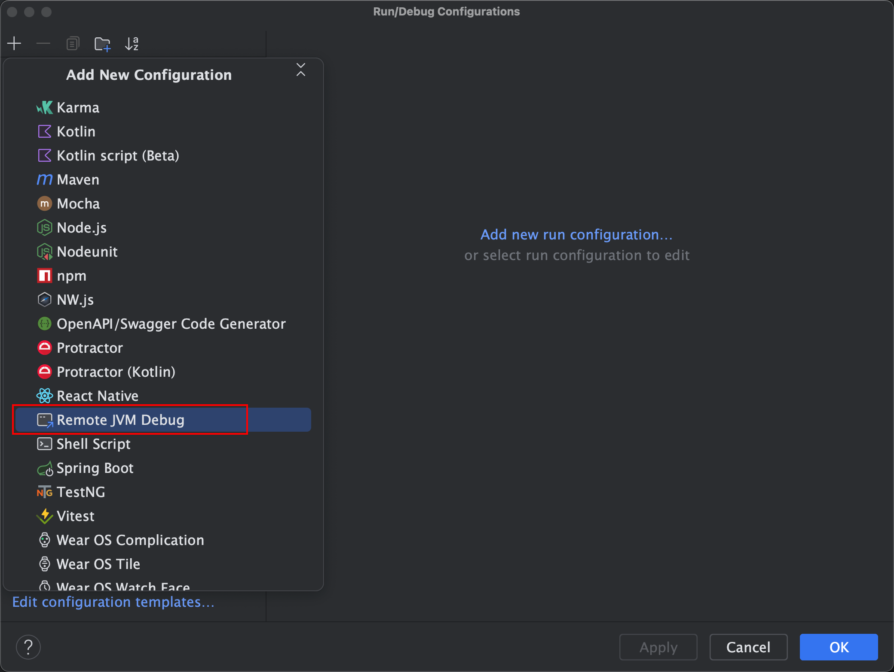
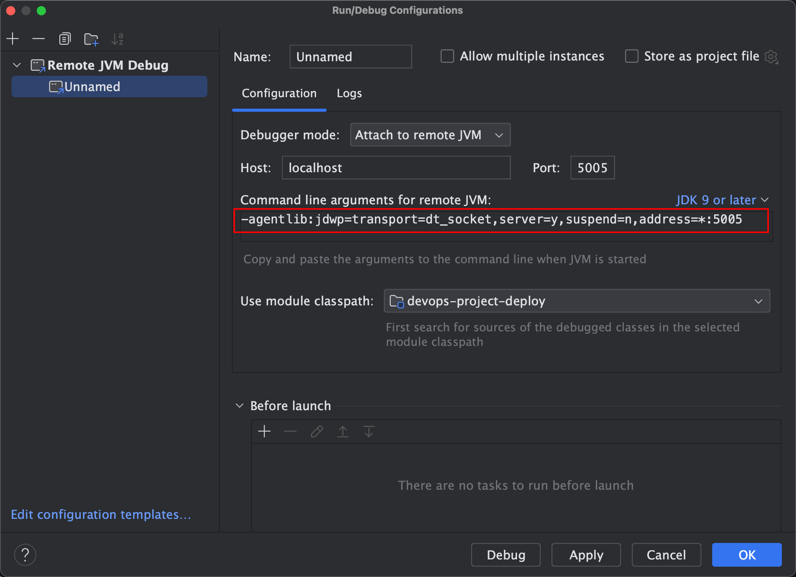
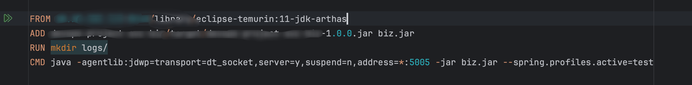
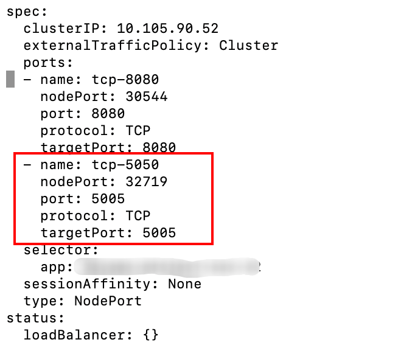
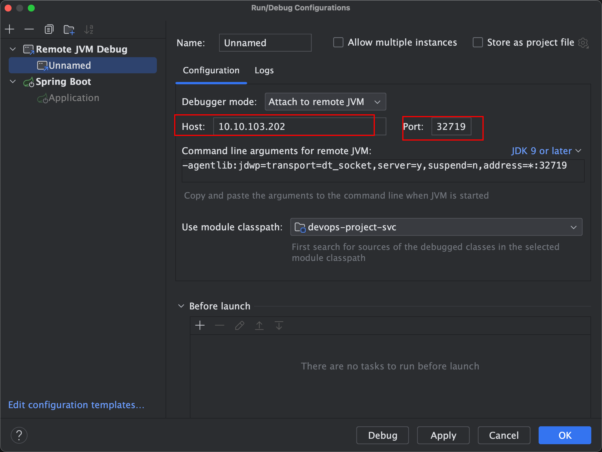
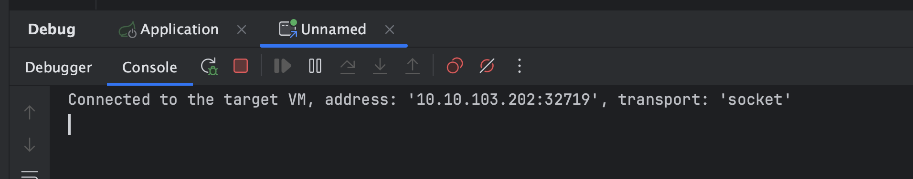

# 杂谈 - 线上环境远程debug调试

- idea选择服务配置，新增一个远程debug，如下图：

- 界面会显示服务启动增加的参数，如下图：参数`-agentlib:jdwp=transport=dt_socket,server=y,suspend=n,address=*:5005`

- 因为服务是k8s部署，需要在dockerfile当中增加这行参数，如下图：

- 需要在服务的deploy增加一个5005端口映射，会映射出来一个nodeport端口，如下图：

- 执行`get svc`查看对应服务5005端口暴露出来的nodeport端口，查看pod所处对应节点IP地址
- 回到idea，添加服务所在的node ip 和nodeport，如下图：

- 启动服务，控制台展示如下图所示，说明服务启动成功，接下来就可以debug线上代码了。

