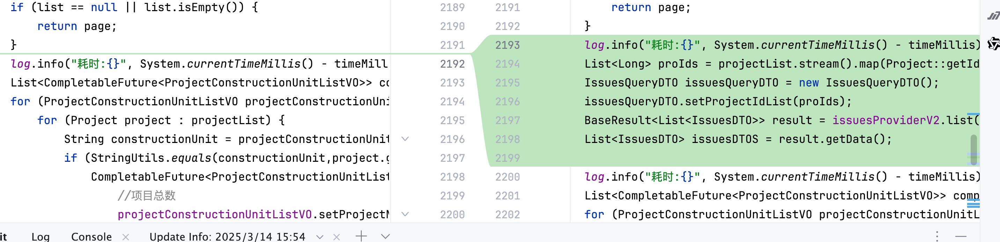

# 性能优化-从五十多秒优化到八百多毫秒

## 背景信息

- 项目上有个看板接口，公司开发环境十来秒，客户环境五十多秒，技术经理觉得这个接口太慢了，在客户环境打开，动不动超时
- 让我去优化一下这个接口，所以有了这篇文章

## 前置信息

- 需要收集足够的性能指标，我们才能够去优化代码，这里只用到两个工具，就是
  - async-profiler
  - VisualVM
- 具体工具就不介绍了，到时候另开一篇文章介绍

## 优化步骤

- VisualVM查看服务的负载情况，发现cpu使用率基本为0，方法的基本逻辑如下图：

```java
// 业务逻辑 ---
for (ProjectConstructionUnitListVO projectConstructionUnitListVO : list) {
            for (Project project : projectList) {
                String constructionUnit = projectConstructionUnitListVO.getConstructionUnit();
                if (StringUtils.equals(constructionUnit,project.getConstructionCompany())) {
                	Page<MemberVO> memberVOPage = memberService.page(memberPageQuery);
                    // 业务逻辑  	
                  // 需求
                  issuesProviderV2.list(issuesQueryDemandDTO);
                  // 缺陷
                  issuesProviderV2.list(issuesQueryDemandDTO);
```

- 第一个优化是使用并行化，将所有的cpu利用起来，修改代码如下：

```
for (ProjectConstructionUnitListVO projectConstructionUnitListVO : list) {
            for (Project project : projectList) {
                String constructionUnit = projectConstructionUnitListVO.getConstructionUnit();
                if (StringUtils.equals(constructionUnit,project.getConstructionCompany())) {
                    CompletableFuture<ProjectConstructionUnitListVO> future = CompletableFuture.supplyAsync(() -> {
                    Page<MemberVO> memberVOPage = memberService.page(memberPageQuery);
                    // 业务逻辑  	
                  // 需求
                  issuesProviderV2.list(issuesQueryDemandDTO);
                  // 缺陷
                  issuesProviderV2.list(issuesQueryDemandDTO);
```

- 这时候可以看到火焰图从下图：


- 变成了下图：


- 然后从cpu占用比较多的来看，constructionUnitInfo占用62.98%，memberService.page占用了51%，优先解决这块，该方法主要是获取项目成员信息，这里的优化点：我们绕过项目管理服务的成员模块，减少项目管理成员的封装和转换，直接调用底层权限接口，获取对应资源的所属用户列表，这属于项目的定制化逻辑，不做解释


- 这样新的火焰图就变成了这样，


- 然后发现右侧有一部分的BeanUtils.copyProperties(s,issuesDTO);的cpu消耗


- 将BeanUtils.copyProperties(s,issuesDTO);更改成使用mapstruct的对象拷贝，


- 这样新的火焰图就变成了这样，BeanUtils.copyProperties的cpu消耗直接没了


- 异步线程当中重复调用了，能不能将此方法调整到外部直接一次调用返回所有数据，然后在异步处理获取自己的数据

```java
// BaseResult<List<IssuesDTO>> issuesTaskListBaseResult = issuesProviderV2.list(issuesQueryTaskDTO);
                        //需求
                        BaseResult<List<IssuesDTO>> issuesDemandListBaseResult = issuesProviderV2.list(issuesQueryDemandDTO);
                        //缺陷
                       
                        // BaseResult<List<IssuesDTO>> issuesDefectListBaseResult = issuesProviderV2.list(issuesQueryDefectDTO);
```

- 根据这个思路，我门得到了这样的调整，



- 然后新的火焰图就变成了这样


- 本次项目管理的服务优化完成，这样接口就从五十多秒优化到10多秒，查看耗时，发现目前的性能瓶颈主要是issuesProviderV2.list接口带来的，
- 优化issuesProviderV2.list接口
- 发现issuesProviderV2.list当中有一部分BeanUtils.copyProperties，先把这个干掉


- 和技术经理沟通之后，我们所有的数据存储在基表当中，这里可以调整issuesProviderV2.list的逻辑，直接从基表当中获取，直接开干，新增一个接口，从基表从获取数据
- 最后的优化结果如下图：


- 完美结束！！！