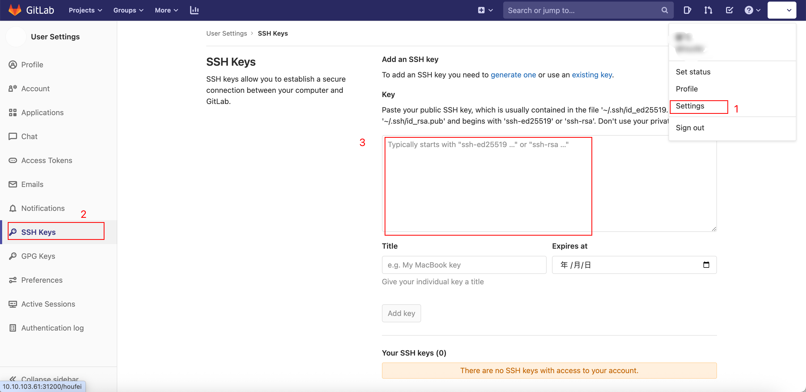

# 代码克隆 - 配置 ssh 克隆代码

- 环境介绍：
  - MacBook Pro Apple M1 Pro
- 本地执行`ssh-keygen -t rsa -b 4096 -C "email"`
- 在`~/.ssh`下会生成公钥id_rsa.pub，查看文件内容
- 登录gitlab，右上角个人便好当中，选择ssh-key

- 将复制的id_rsa.pub拷贝到文本框当中，选择添加
- 完成！
- 可以使用ssh方式克隆代码了
