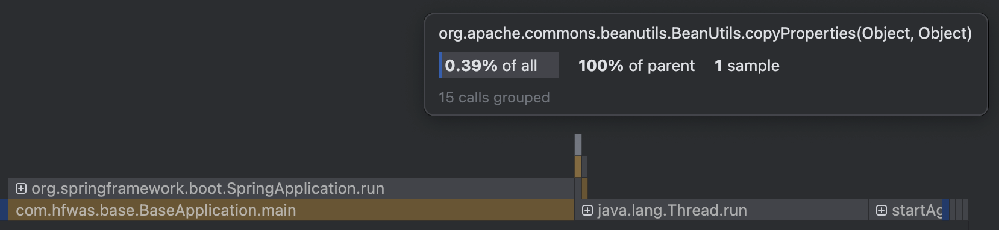

# 杂谈-抛弃Beanutils拥抱MapStruct

网上已经有很多如何使用MapStruct，Beanutils是如何如何不好的文章了，我想换一个角度来思考这个问题，cpu耗时，大家都知道现在程序部署在服务器上，程序运行就是操作系统调度cpu顺序或者并发的解释一条条指令

我们知道程序运行其实就是在争夺服务器的cpu分片，谁能够少用cpu，减少cpu的消耗，就能够提升速度

项目代码通常间接或者直接会引入commons-beanutils依赖，这样大家开发过程当中可能图方便就随手使用了Beanutils来做对象的属性拷贝，但是这么做是有问题，我们来做个小实验来看具体的差别

## cpu耗时

- 新建一个测试工程，新建一个实体类，写一个controller，controller当中同时使用Beanutils和MapStruct来拷贝对象属性，同时使用async-profiler-4.0-macos；来检测程序运行cpu火焰图

```java
@GetMapping
    public String index() throws InvocationTargetException, IllegalAccessException {
        User user = new User();
        user.setId(1);
        user.setUsername("admin");
        user.setPassword("123456");
        user.setSalt("123456");
        user.setEmail("12@163.com");

        UserVO userVO1 = new UserVO();
        
        BeanUtils.copyProperties(user, userVO1);
        // UserVO userVO = UserConvert.INSTANCE.to(user);
        
        return "success";
    }
```

- 首先开启BeanUtils的属性拷贝，然后请求index接口，获得以下的火线图，可以看到BeanUtils还占有0.39%的cpu时长



- 然后关闭BeanUtils，开启MapStruct的属性转换，获得以下的火焰图，可以看到没有MapStruct的cpu消耗


- 两者相比，MapStruct能够直接节省0.39%的cpu支出，当然，在大批量的请求下，节省的时间会更多，我在[性能优化-从五十多秒优化到八百多毫秒](2-performance-optimization.md)这篇文章也有针对Beanutils的优化，大概节省了20%的cpu消耗

## 总结

你写下的每一行代码，其实都在参与资源争夺，凡是使用反射、动态代理、运行时分析的代码，都在偷偷吞噬你的时间，MapStruct 不仅是一种工具选择，更是一种性能哲学，干掉项目代码当中的BeanUtils，积极拥抱MapStruct吧