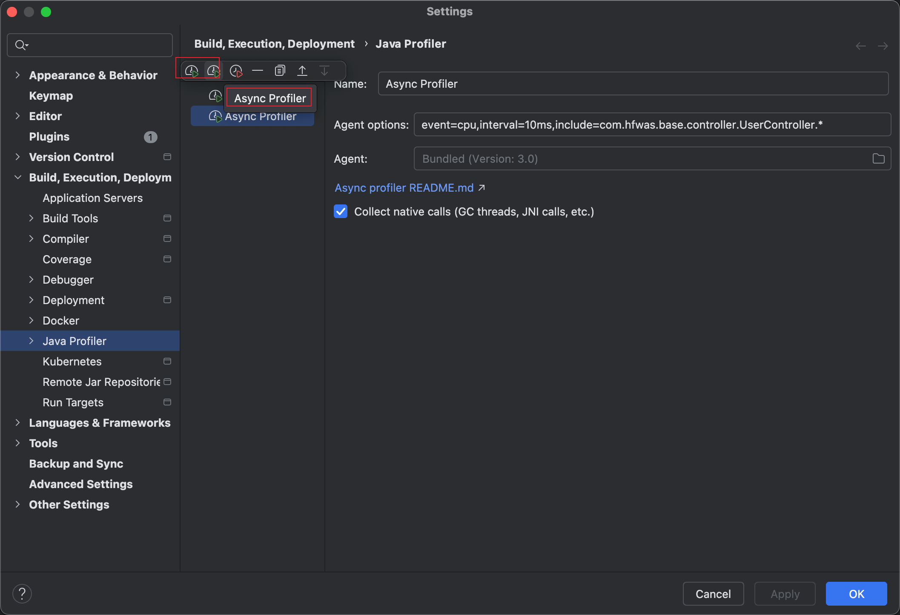
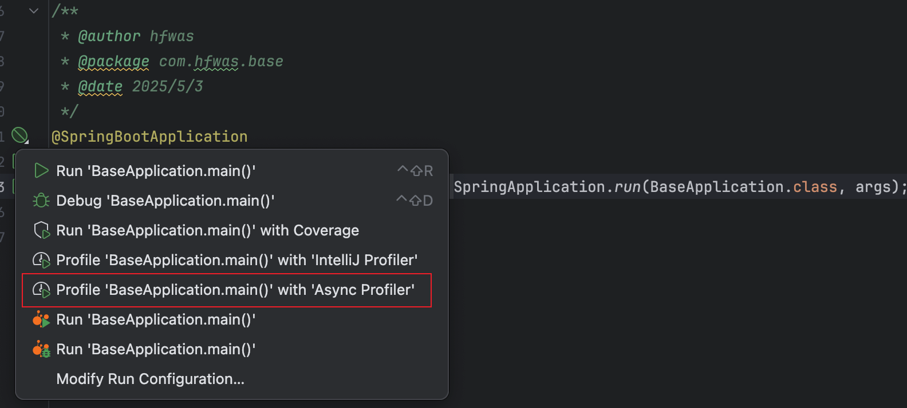
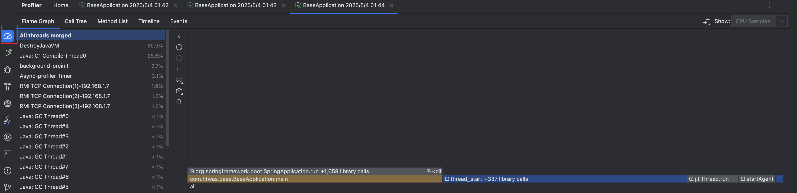

# 杂谈-idea集成asprof

针对我们平常想做性能优化的情况，async-profiler-4.0-macos是必不可少的工具，每次都是在命令行当中单独执行命令来实现数据的采集展示，idea提供了集成async-profiler-4.0-macos的选项，这里出一篇做介绍，

- idea增加async-profiler-4.0-macos的配置，默认是已经有IntelliJ Profiler，点击Async Profiler会增加，初始参数是event=cpu,interval=10ms，

- 点击代码运行时，会有Async Profiler的提示，点击Async Profiler运行即可，

- 程序运行之后，会弹出一个监控页面，点击停止采样，会展示当前运行的火焰图效果

- 