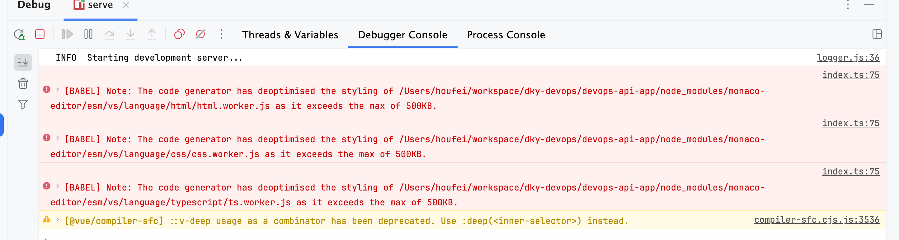

---
category:
  - node
tag:
  - node
---
# 报错记录 - The code generator has deoptimised the styling of xxxx.js as it exceeds the max of 500kb
- Vue-press本地运行当中启动行报错，显示exceeds the max of 500kb文件超过500kb大小，



- 在项目路径下创建`.babelrc`文件，文件当中写入以下内容解决：

```json
{
  "compact": false
}
```