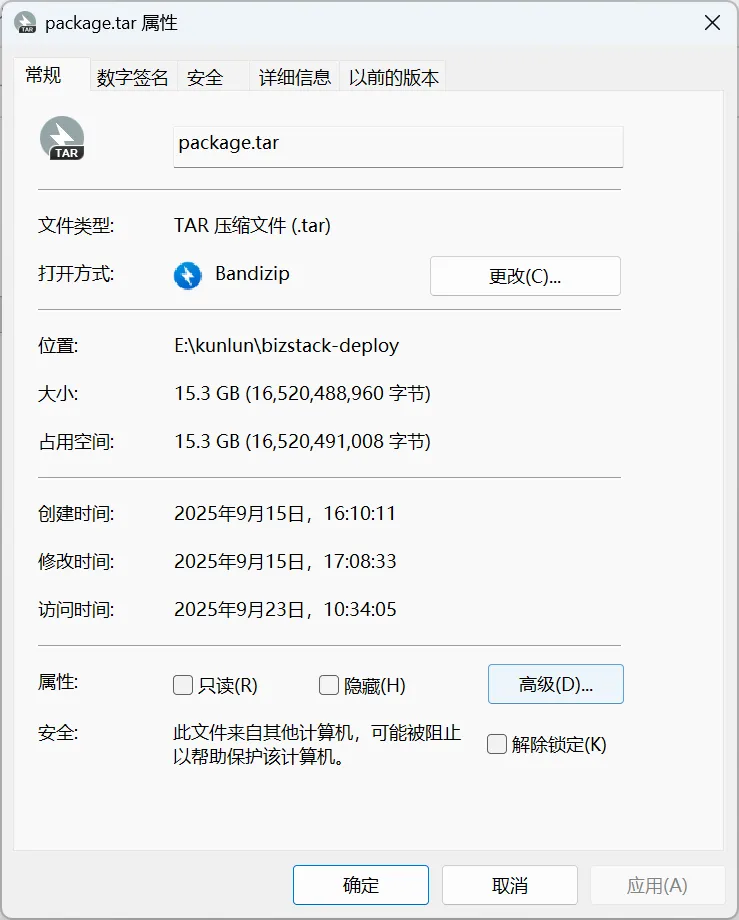
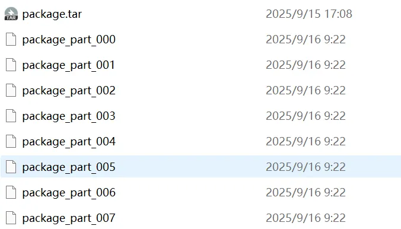

# Linux-大文件切片传输

## 前提操作

- windows：默认没有split命令，需要安装一个git客户端，git bash默认自带split命令
- mac：默认自带split命令

## 背景知识

- 部分客户的内网传输有限制，一般为2G大小，需要将镜像文件分片传输到内网，在内网通过合并拿到原始文件，
- 钉钉/飞书/微信这些聊天软件也有文件传输大小限制，可以先将大文件切割分片，拿到所有分片文件之后再合并

## 实践

查看文件大小：



执行命令：`split -b 2G -d -a 3 package.tar package_part_`



执行合并：

```
cat package_part_* > package.tar
```

