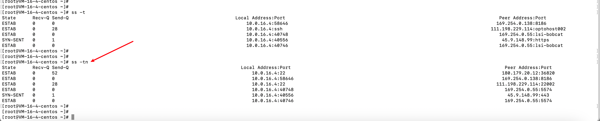
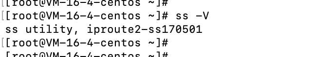
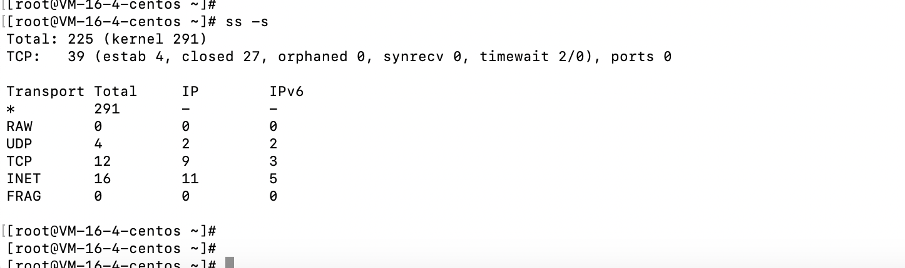
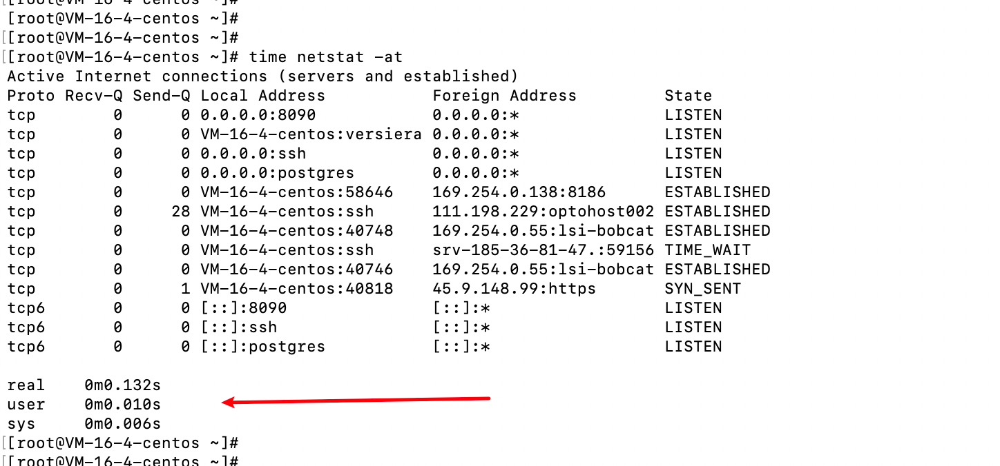

# Linux操作--ss命令

- ss命令和netstat命令用法类似，ss命令的出现也是为了替代netstat命令的。
- netstat连接数达到了上万级别的时候，执行该命令查询会很耗时，而ss命令的出现就是为了解决该问题。
- ss的速度比netstat的速度快的原因是：使用到了tcp协议栈中tcp_diag。tcp_diag是一个统计分析的模块，可以获得linux内核当中的第一手的信息，这就确保了ss的快捷高效

## 参数

- -n： 不解析服务名称，展示对应的应用名称。
  - 展示了不解析和解析两个的展示区别。

- -t：展示tcp协议

- -d：展示udp协议
- -l：展示监听的程序。
- -V：查看程序版本信息
  - ss是iproute2包附带的一个工具，允许查询socket的有关统计信息。

- -a：展示所有的套接字
- -s：显示套接字使用概况

- -o 输出格式化，
  - 例如显示所有状态为established的SMTP连接：`ss -o state established '( dport = :smtp or sport = :smtp )'`

## 语法

- dst ： 目标地址
- src  ： 源地址
- dport ： 目标端口
- sport ： 源端口

### 特殊用法

- 可以通过`ss dport OP PORT`做端口或者地址的过滤，dport可以换成以上四个当中的任意一个。
- 匹配目标地址，执行`ss dst 101.38.194.121`

![image-20231101222751405]./images/image-20231101222751405.png)

- 

## 效率对比

- 执行ss和netstat效率对比

  - 执行`time netstat -at`

  

  - 执行`time ss -at `

  ![image-20231101221335231]./images/image-20231101221335231.png)

  - 

  

