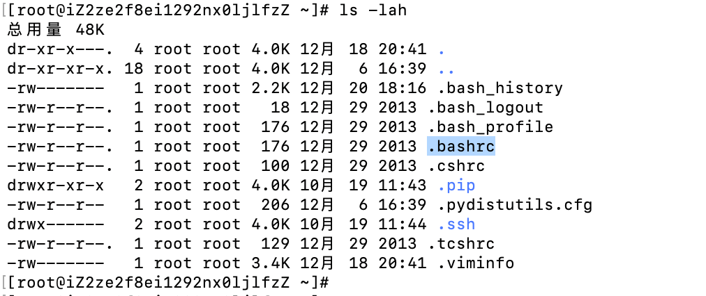
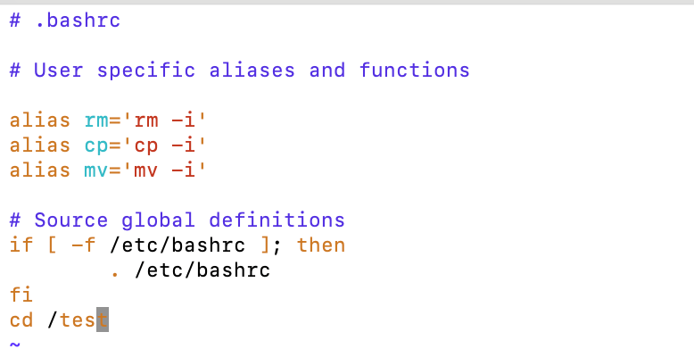

# Linux操作-登录之后默认进入目录

- 用户通过ssh登录之后，会默认进去一个目录，linux当中这个目录通常是在/etc/passwd当中设置的，例如，下图所示：，root用户登录之后的默认目录是/root，bin用户登录之后的默认目录是/bin。

- 修改用户登录的默认目录，可以通过修改/etc/passwd文件当中内容实现

- 也可以通过修改修改.bashrc文件实现，

- 例如，root用户登录之后默认目录想修改为/test目录，在.bashrc文件当中增加一行，`cd /test`

- 