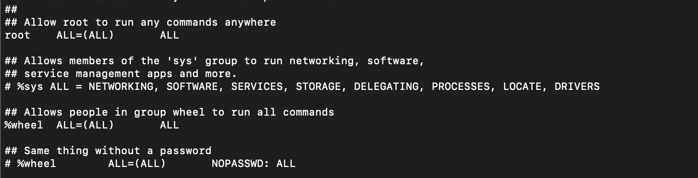

---
category:
  - shell
tag:
  - shell
---
# Linux操作-修改sudo配置

## 问题场景

- 使用ansible当中其他虚拟机ssh只开放了一个7890端口，使用的账号是非root账号，虚拟机开启了禁止root登录，远程执行报错没有sudo权限

## 解决办法

- 执行`visudo `命令，修改sudo配置，增加非root账号的sudo权限
- 在%whell下边增加一行,增加一行数据为`%ALL ALL=(ALL) ALL`，允许所有组的用户都可以执行所有命令

- 还可以将非root用户加入到wheel组当中，这样就不用修改sudo配置就可以解决问题
