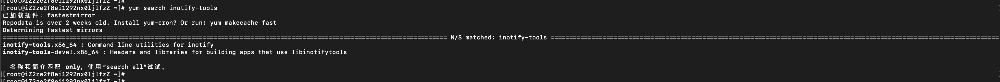
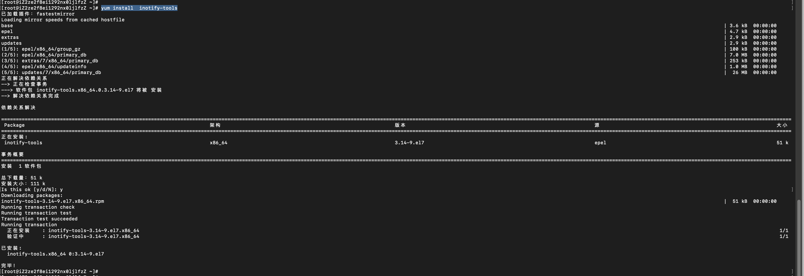
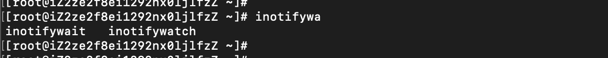
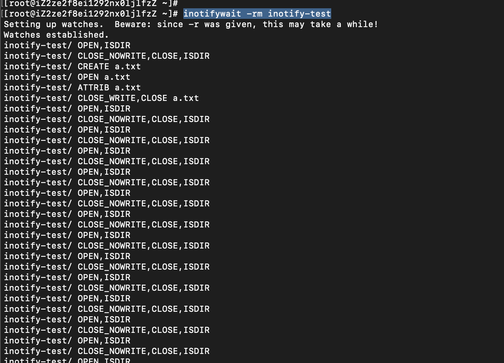

---
category:
  - linux
tag:
  - inotify
---

# Linux-inotify命令

## 基本介绍

- inotify是一种强大的异步文件系统监控机制，可以监控文件系统的访问属性，读写属性，权限属性，删除创建，移动等操作，可以监控文件系统的所有变化。
- 提供了两个命令：
  - inotifywait命令：可以收集有关文件访问信息，
  - inotifywatch命令：用于收集被监控的文件系统的统计数据，包括每个inotift事件发生多少次

## 安装

- 基础环境：`Linux iZ2ze2f8ei1292nx0ljlfzZ 3.10.0-1160.99.1.el7.x86_64 #1 SMP Wed Sep 13 14:19:20 UTC 2023 x86_64 x86_64 x86_64 GNU/Linux`
- 执行命令：`yum search inotify-tools`



- 执行命令：`yum install inotify-tools`



- 然后就会有两个命令：分别是：inotifywait和inotifywatch



## 常用参数

```
-m 始终保持监听状态，默认触发事件即退出

-r 递归查询目录

-q 减少不必要的输出

-e 定义监控的事件
  access	访问 ，读取文件。
  modify	修改 ，文件内容被修改。
  attrib	属性 ，文件元数据被修改。
  move	移动 ，对文件进行移动操作。
  create	创建 ，生成新文件
  open	打开 ，对文件进行打开操作。
  close	关闭 ，对文件进行关闭操作。
  delete	删除 ，文件被删除。
	
--excelude 指定要排除的文件/目录

--timefmt 时间格式，%y年 %m月 %d日 %H时 %M分钟

--format 输出格式，%T时间 %w路径 %f文件名 %e状态
```

## 使用

- 监听目录下所有文件的变动，执行`inotifywait -rm inotify-test`，在文件夹下新间a.txt文件，更改内容，可以看到




