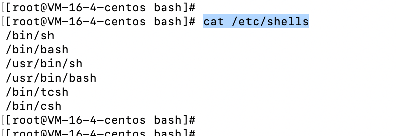

# Shell-基础知识

- Shell是一个命令解释器，它接受应用程序/用户命令，然后调用操作系统内核
- shell还是一个功能相当强大的编程语言，易编写，易调试，灵活性强

## 查看支持的shell

- 执行`cat /etc/shells`



## 变量

- 系统预定义变量

  - 常用系统变量
  
  ```
  $HOME, $PWD, $SHELL, $USER等
  ```
  
  - 查看系统变量


- 自定义变量
  - 基本语法：
    - 定义变量：变量名=变量值，注意：=后前后不能有空格
    - 撤销变量：unset 变量名
    - 声明静态变量：readonly 变量，注意：不能unset
    - 将局部变量提升为全局变量，执行`export 变量名`
  - 变量定义规则
    - 变量名称可以由字母，数字，下划线组成，但是不能以数字开头，环境变量名建议大些
    - 等号两侧不能有空格，
    - 在bash中，变量默认类型都是字符串类型，无法直接进行数值运算，
    - 变量的值如果有空格，需要使用双引号或者单引号扩起来
- 特殊变量
  - `$n`： 功能描述：
    - `$0`,代表该脚本名称
    - $1～$9,表示第一个到第九个参数，十以上的参数需要用大括号包含，例如`${10}`
  - `$#`： 获取所有输入参数个数，常用于循环，判断参数的个数是否正确以及加强脚本的健壮性
  - `$*`：代表命令行中所有的参数，`$*`把所有的参数看成一个整体
  - `$@`：代表命令行中所有的参数，`$@`把每个参数区分对待
  - `$?`： 最后一次执行的命令的返回状态，如果这个变量的值为0，证明上一个命令正确执行；如果这个变量的值非0，则证明上一个命令执行不正确
- 运算符
  - 基本语法：`$((运算式)) 或者 $[运算式]`
- 条件判断
  - 基本语法：test [条件]
  - 常用判断条件
    - 两个整数之间的判断
      - -eq ： 等于
      - -lt：小于
      - -gt：大于
    - 按照文件权限进行判断 
      - -r : 有读的权限
      - -w: 有写的权限
      - -x: 有执行的权限
    - 按照文件类型进行判断
      - -e 文件存在
      - -f 文件存在并且是一个常规的文件
      - -d 文件存在并且是一个目录
- 数组
  - 获取数组长度`${#arr[@]}`
  - 截取数组当中索引为1以后的数组，`("${aa[@]:1}")`
  - 按照空格划分字符串为数组，`path=(${result[@]// / })`


## 流程控制

- If基本语法

  - 单分支

  ```
  if [ 条件判断式 ];then
  	程序
  fi
  ```

  - 多分支

  ```
  if [ 条件判断式 ];then
  	程序
  elif [ 条件判断式 ];then
  	程序
  else
  	程序
  fi
  ```

- Case语句

  - 基本语法

  ```
  case $变量名 in
  "值1")
  	如果变量的值等于1，执行程序前
  ;;
  "值2")
  	如果变量的值等于2，执行程序2
  ;;
  "值3")
  	如果变量的值等于2，执行程序2
  *)
  	如果变量都不是以上的值，执行此程序
  ;;
  esac
  ```

  - 注意事项
    - case 行尾必须为单次"in"，每一个模式匹配必须以右括号")"结束
    - 双分号";;"表示命令序列结束，相当于java中的break
    - 最后的"*)"表示默认模式，相当于java的default

- For循环

  - 基本语法

  ```
  for item in $变量;do
  	实际逻辑
  done
  ```

  - 案例

  ```
  for item in $*;do
  	echo $item
  done
  ```

- While循环

  - 基本语法

  ```
  while [ 条件判断式 ];do
  	程序
  done
  ```

  

## 读取控制台输入

- 基本语法
  - read 选项 参数
  - 选项
    - -p: 指定读取值时的提示符
    - -t：指定读取值时等待的时间（秒）如果-t不加表示一直等待
  - 参数
    - 变量：指定读取值的变量名
- 实操
  - read -t 10 -p "enter your name" name

## 函数

- 系统函数
  - basename
    - `basename [string / pathname] [suffix]`： basename命令会删除所有的前缀包括最后一个(/)字符，然后将字符串显示出来
    - basename 可以理解为取路径里的文件名称
    - 选项：
      - Suffix 为后缀，如果suffix被指定了，base name 会将pathname 或 string 中的suffix去掉
  - dirname 
    - dirname 文件绝对路径，从给定的包含绝对路径的文件名中移除文件名（非目录的部分），然后返回剩下的路径(目录的部分)
    - dirname 可以理解为取文件路径的绝对路径名称
- 自定义函数


