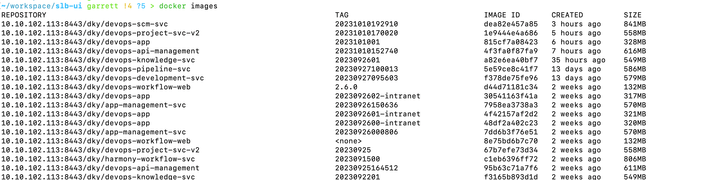
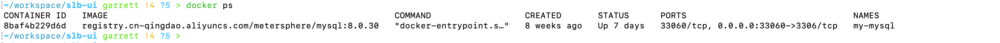
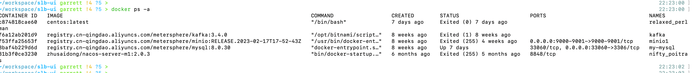
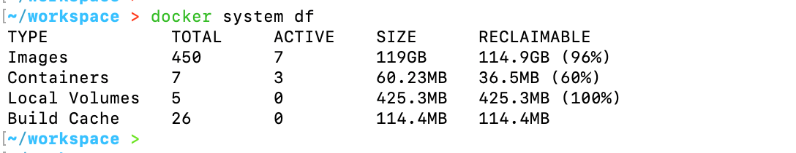
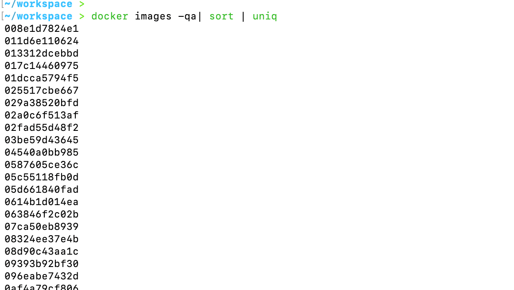
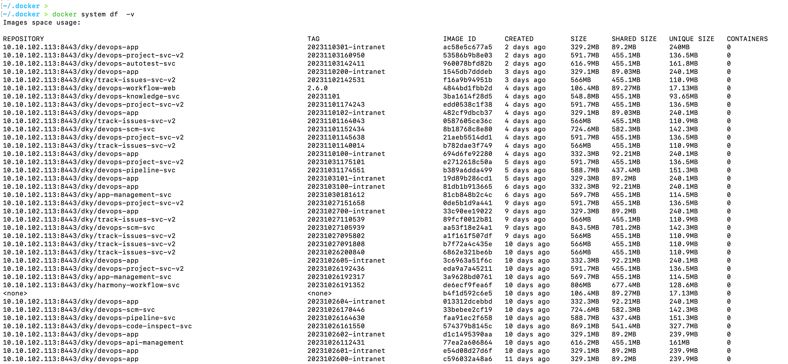
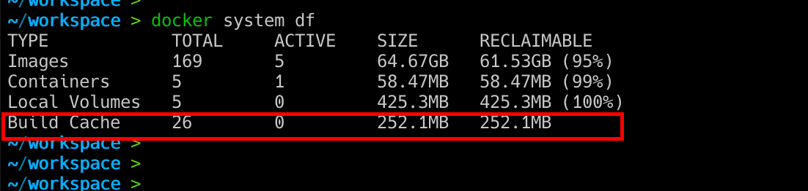

---
category:
  - docker
tag:
  - docker
---
# Docker基础知识-常见命令

- 查看当前虚拟机下镜像列表，执行`docker ./images`

- 查看当前虚拟机正在运行的容器集合，执行`docker ps`

- 查看当前机器所有的容器集合，包括已退出的，执行`docker ps -a `

- 运行镜像，执行`docker run -it 镜像ID -- sh `
- 查看docker占用的磁盘大小，执行`docker system df `，

- 清理磁盘，删除关闭的容器、无用的数据卷和网络，以及 dangling 镜像(即无 tag 的镜像)，执行`docker system prune`，加上参数`-a`的话会清理得更加彻底，可以将没有容器使用 Docker 镜像都删掉

- 获取所有镜像的镜像ID列表，执行`docker ./images -qa`，可以加上`sort`和`uniq`做排序和过滤重复的

- 查看每个镜像文件的大小，执行`docker system df -v`

- 清理docker构建缓存，执行`docker builder prune`

- 