# Docker基础知识-docker网络

- 完全空的虚拟机，执行`ip address`

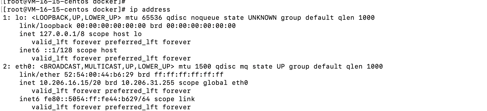

- 安装完docker之后，执行`ip address`，发现多了一个docker0的接口，

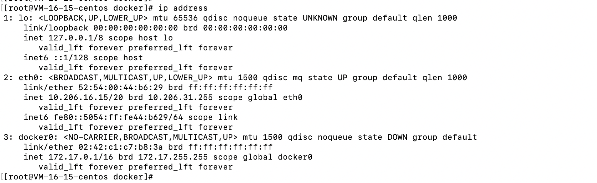

- 查看docker提供的网络形式，执行`docker network ls `

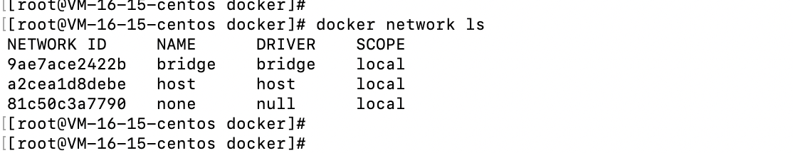

- 查看默认docker提供的网络，执行`docker network inspect 9ae7ace2422b `

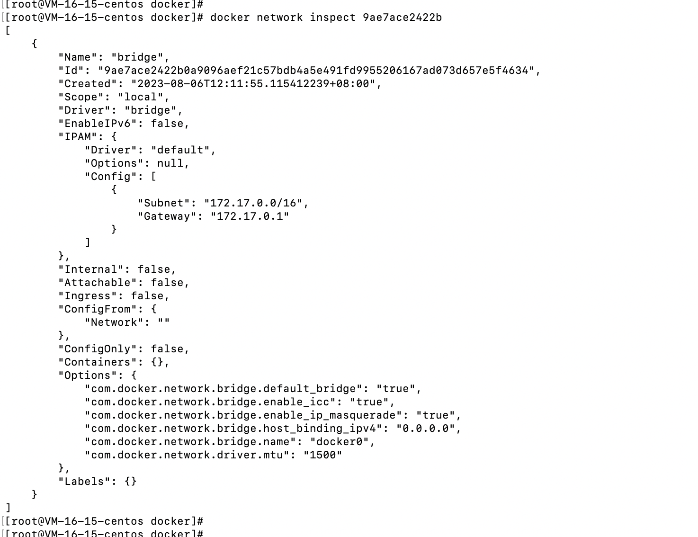

- 创建一个容器，执行`docker run -d --name egg1 --hostname egg1 praqma/network-myltitool`，查看网络`docker network inspect bridge | jq '.[0] | {Name:.Name, Id: .Id, Created: .Created,Driver: .Driver, IPAM: .IPAM.Config, Containers: .Containers, Options: .Options}'`

- 执行`ip address`，发现接口多了一个名称为`vethcd0f116@if4`的接口，接口序号直接是5，少了一个4的接口，可以看到master docker0，

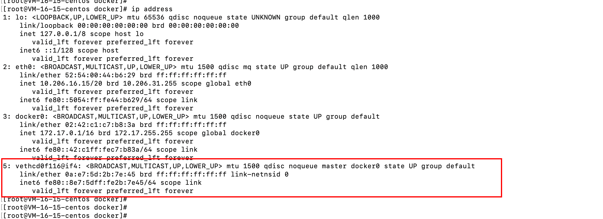

- 进入容器当中查看，执行`docker exec -it egg1 ip -c address`

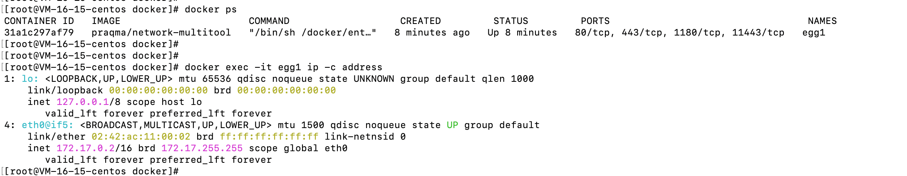

- 在容器当中执行`ip -json -detail address show dev eth0 | jq '.[0] | {ifindex: .ifindex, linx_index:.link_index, ifname:.ifname,linkinfo:.linkinfo,addr_info:.addr_info}'`

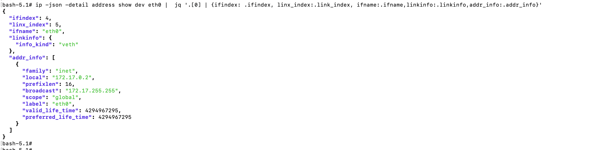

- 测试在创建一个容器，发现容器自动加入了bridge网络当中，

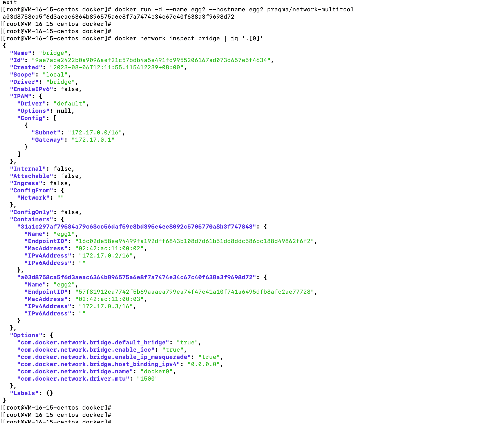

- 宿主机当中执行`ip address`，发现多了一个接口序号为7的接口

- 可以总结为以下的图片

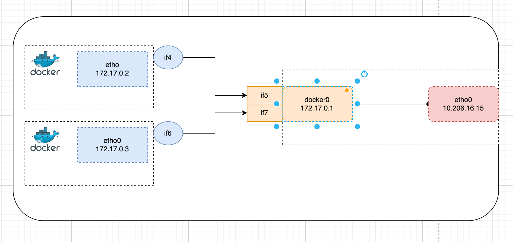

- 表格总结为：

- 

## 网络访问

### bridge模式

- 从容器内访问网关，docker0

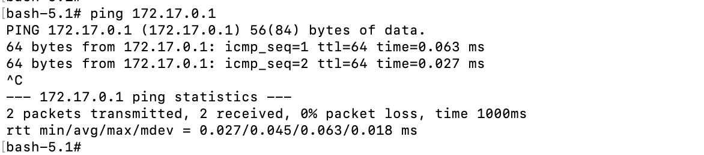

- 容器访问容器

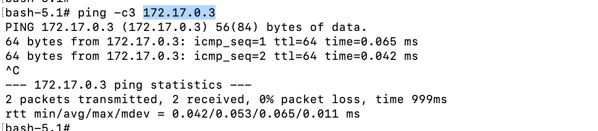

- 容器访问宿主机

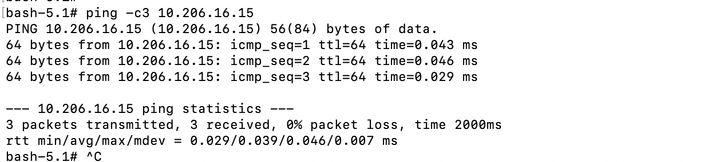

- 容器内访问服务名称，

- 在宿主机上访问测试

  - 是否可以访问容器

  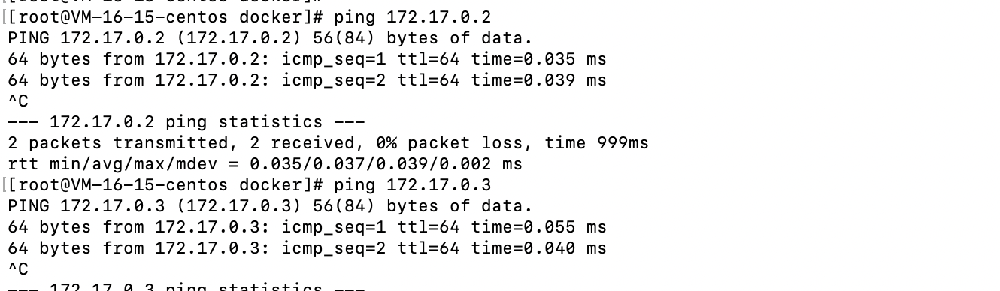

  - 是否可以访问服务名称

  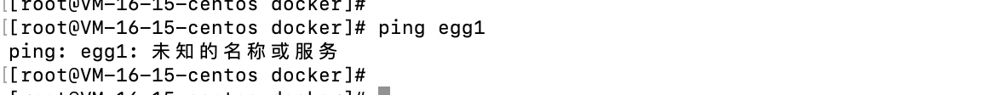

### docker dns问题

- 创建自定义 网络，执行`docker network create -d bridge naihe-bridge`

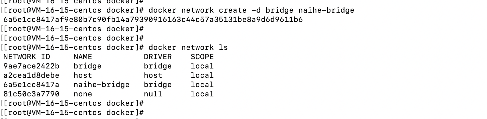

- 创建完bridge之后，发现出现了一个新的接口，类似docker0接口

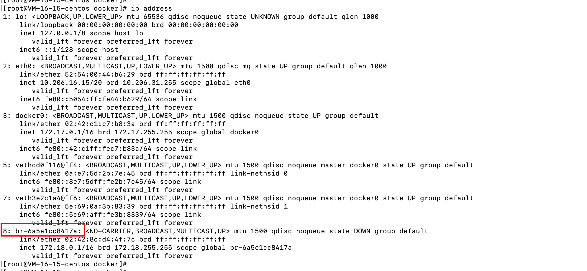

- c创建两个容器，使用自定义的网络接口，然后查看ip，发现多了两个接口

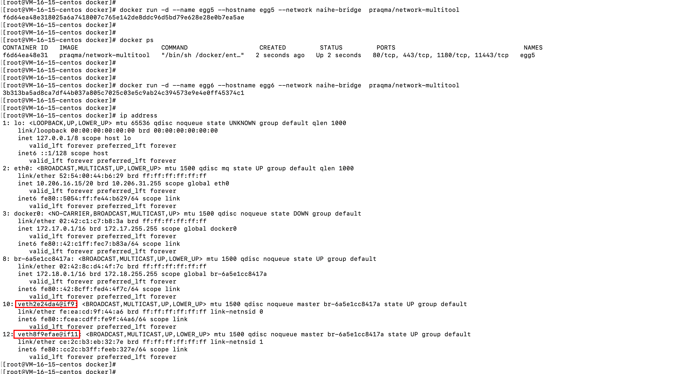

- 进入容器egg5当中，查看docker dns是否起作用，测试发现自定义网络接口，docker dns起作用了。

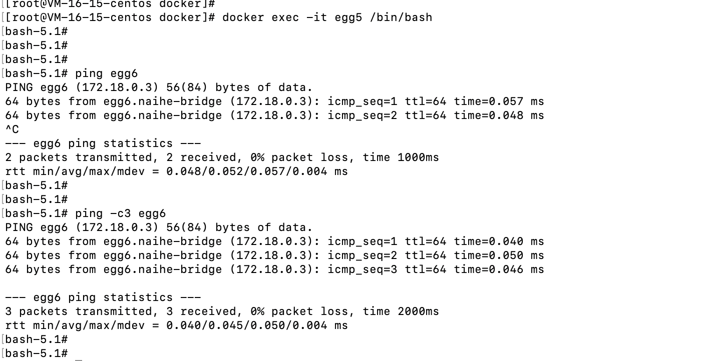

- 

### host网络

- host网络不能删除，只能有一个
- 直接使用的宿主机的网络

### none网络

- 不能联网

## 总结

|      | 默认bridge | 自定义bridge   | host              | none     |
| ---- | ---------- | -------------- | ----------------- | -------- |
| 优点 | 自动加入   | 自动DNS，隔离  | 网络性能佳        | 隔离     |
| 缺点 | 无自动DNS  | NAT            | 安全问题，仅linux | 不能联网 |
| 场景 | 不建议     | 单宿主机多容器 | 单容器多端口      |          |

