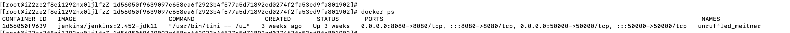
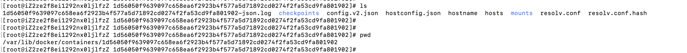
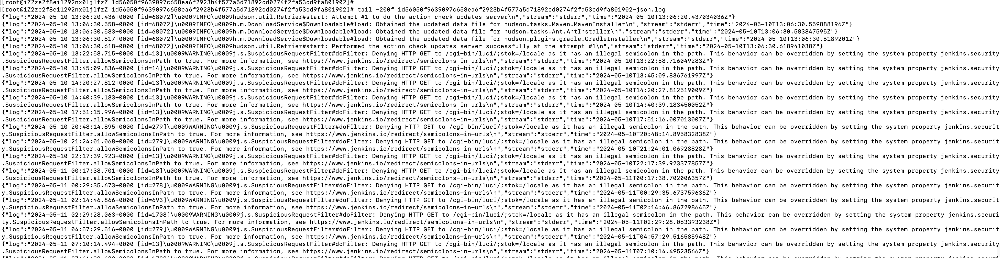

---
category:
  - docker
tag:
  - docker
---
# Docker进阶知识-docker日志

- docker提供了一个参数可以查看容器当中的日志信息，`docker logs -f 容器ID`
- 实际上这个输出来源是docker的日志存储位置，具体为：`/var/lib/docker/containers/容器ID值/容器ID值-json.log`，每个容器docker都会有这样的一个json文件
- 如果要备份日志文件，就可以参考这个原理，直接拷贝`/var/lib/docker/containers/容器ID值/容器ID值-json.log`文件即可
- docker官网提供了自动化的方案：https://docs.docker.com/config/containers/logging/json-file/
  - 修改 Docker 是配置文件：`vim /etc/docker/daemon.json`，增加如下内容：

```
{
  "log-driver": "json-file",
  "log-opts": {
    "max-size": "10m",
    "max-file": "5"
  }
}
```

- 验证：

  - 执行`docker ps `查看当前容器列表

  

  - 执行`cd /var/lib/docker/containers/1d56050f9639097c658ea6f2923b4f577a5d71892cd0274f2fa53cd9fa801902`

  

  - 查看`1d56050f9639097c658ea6f2923b4f577a5d71892cd0274f2fa53cd9fa801902-json.log`可以和`docker logs`命令输出的日志对比一下，发现是 一样的

  

- 