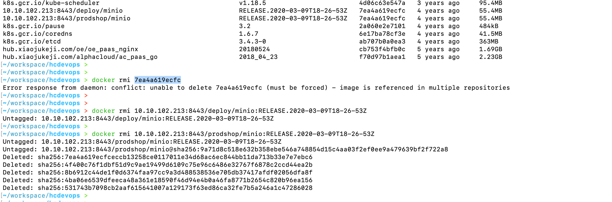

---
category:
  - docker
tag:
  - docker
---
# docker基础知识-删除镜像-image is referenced in multiple repositories

- 本地镜像清理，执行`docker rmi 镜像ID`报错，

- 解决办法：
  - 执行`docker rmi 镜像地址：镜像版本`即可。
  - bash环境下手动执行`docker rmi $(docker images | awk '{print $1 ":" $2}' | grep repo | grep -v REPOSITORY)`，可以手动修改repo来删除指定仓库REPOSITORY镜像