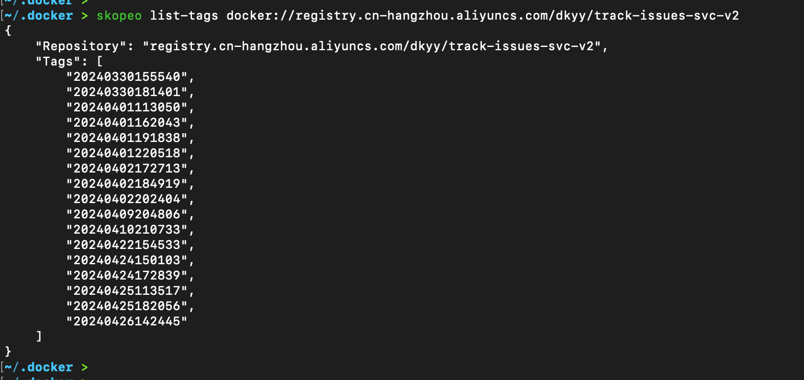

# docker进阶知识-docker镜像同步skopeo

## 参数

- copy：复制一个镜像从 A 到 B，这里的 A 和 B 可以为本地 docker 镜像或者 registry 上的镜像；
- inspect：查看一个镜像的 manifest 或者 image config 详细信息；
- delete：删除一个镜像 tag，可以是本地 docker 镜像或者 registry 上的镜像；
- list-tags：列出一个 registry 上某个镜像的所有 tag；
- login：登录到某个 registry，和 docker login 类似；
- logout： 退出已经登录到某个 registry 的 auth 信息，和 docker logout 类似；
- manifest-digest：几圈一个文件的 sha256sum 值；
- standalone-sign、standalone-verify 这两个是和镜像加密相关的，使用的不是很多；
- sync：同步一个镜像从 A 到 B，感觉和 copy 一样，但 sync 支持的参数更多，功能更强大；

## 支持格式

- dir:path ： 支持本地存储
- docker://docker-reference： 将镜像同步到另外一个registry 
- docker-archive:path[:docker-reference] ： 类似docker save的效果，保存为本地.tar包的形式
- docker-daemon:docker-reference ：保存为docker本地镜像，存储在本地镜像格式
- oci:path:tag ： 实现了oci标准的

## 常见用法

- 获取镜像仓库当中指定镜像的所有版本，执行`skopeo list-tags docker://registry.cn-hangzhou.aliyuncs.com/dkyy/track-issues-svc-v2`

- 

