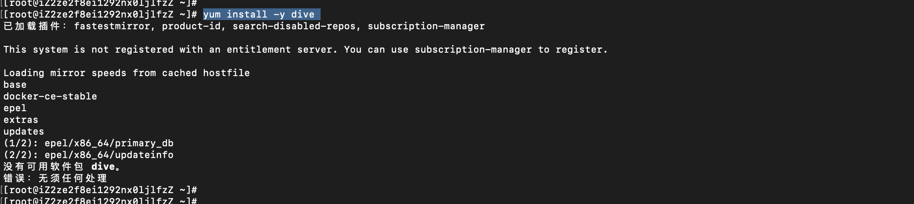
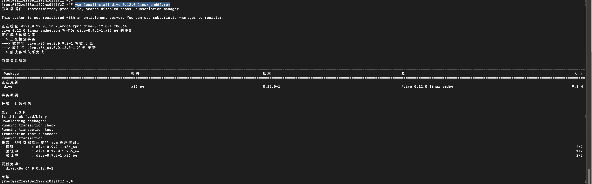
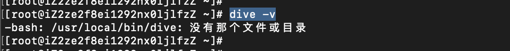
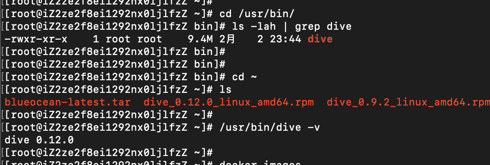
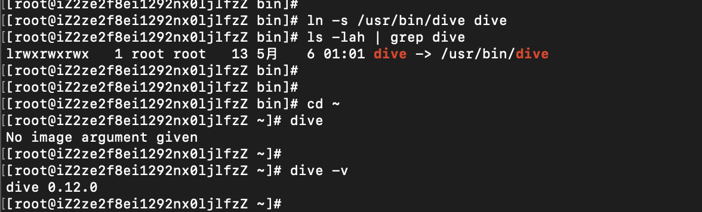

---
category:
  - docker
tag:
  - docker
  - skopeo
---

# Docker进阶知识-dive命令详解

## 安装

- 执行`yum -y install dive`显示找不到对应的包



- 查看yum源配置，

```
[root@iZ2ze2f8ei1292nx0ljlfzZ ~]# cat /etc/yum.repos.d/
CentOS-Base.repo  docker-ce.repo    epel.repo         redhat.repo       
[root@iZ2ze2f8ei1292nx0ljlfzZ ~]# cat /etc/yum.repos.d/CentOS-Base.repo 
[base]
name=CentOS-$releasever
enabled=1
failovermethod=priority
baseurl=http://mirrors.cloud.aliyuncs.com/centos/$releasever/os/$basearch/
gpgcheck=1
gpgkey=http://mirrors.cloud.aliyuncs.com/centos/RPM-GPG-KEY-CentOS-7

[updates]
name=CentOS-$releasever
enabled=1
failovermethod=priority
baseurl=http://mirrors.cloud.aliyuncs.com/centos/$releasever/updates/$basearch/
gpgcheck=1
gpgkey=http://mirrors.cloud.aliyuncs.com/centos/RPM-GPG-KEY-CentOS-7

[extras]
name=CentOS-$releasever
enabled=1
failovermethod=priority
baseurl=http://mirrors.cloud.aliyuncs.com/centos/$releasever/extras/$basearch/
gpgcheck=1
gpgkey=http://mirrors.cloud.aliyuncs.com/centos/RPM-GPG-KEY-CentOS-7[root@iZ2ze2f8ei1292nx0ljlfzZ ~]# 
[root@iZ2ze2f8ei1292nx0ljlfzZ ~]# 
```

- 下载dive rpm包，执行`curl -OL https://github.com/wagoodman/dive/releases/download/v0.12.0/dive_0.12.0_linux_amd64.rpm`，下载最新的dive版本
- 执行`yum localinstall dive_0.12.0_linux_amd64.rpm`



- 执行`dive -v`报错



- 进入`/usr/bin`下查看是否有dive命令，执行`/usr/bin/dive -v `可以看到dive已经被替换为0.12.0版本



- 在`/usr/local/bin/`下建立软连接到`/usr/bin/dive`即可，执行`ln -s /usr/bin/dive dive`



- 完成！！

## 使用
