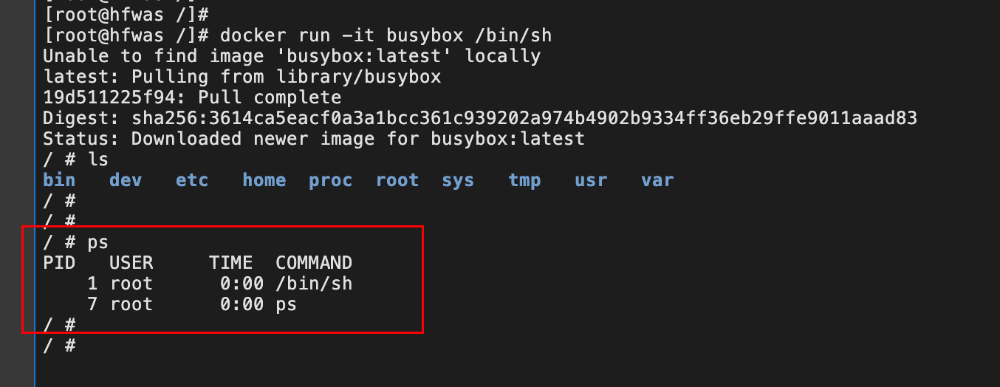

---
category:
  - docker
tag:
  - docker
---
# Docker进阶-容器本质

- 容器其实是一种沙盒技术。顾名思义，沙盒就是能够像一个集装箱一样，把你的应用“装”起来的技术。这样，应用与应用之间，就因为有了边界而不至于相互干扰；而被装进集装箱的应用，也可以被方便地搬来搬去。
- k8s是解决容器平台控制平面的问题，比如把容器调度到一个合适的宿主机上。 而容器一旦在宿主机上运行起来之后，它的隔离方式是否正确，资源的限制是否合理，它自身的性能是否会出问题，它是否会影响到同一个宿主机上别的容器，或者直接影响到宿主机，这些问题的考虑，就需要容器相关知识了。

## 进程

- 假如，现在你要写一个计算加法的小程序，这个程序需要的输入来自于一个文件，计算完成后的结果则输出到另一个文件中。
- 由于计算机只认识 0 和 1，所以无论用哪种语言编写这段代码，最后都需要通过某种方式翻译成二进制文件，才能在计算机操作系统中运行起来。
- 为了能够让这些代码正常运行，我们往往还要给它提供数据，比如我们这个加法程序所需要的输入文件。这些数据加上代码本身的二进制文件，放在磁盘上，就是我们平常所说的一个“程序”，也叫代码的可执行镜像（executable image）。
- 然后，我们就可以在计算机上运行这个“程序”了。
  - 首先，操作系统从“程序”中发现输入数据保存在一个文件中，所以这些数据就会被加载到内存中待命。
  - 同时，操作系统又读取到了计算加法的指令，这时，它就需要指示 CPU 完成加法操作。而 CPU 与内存协作进行加法计算，又会使用寄存器存放数值、内存堆栈保存执行的命令和变量。
  - 同时，计算机里还有被打开的文件，以及各种各样的 I/O 设备在不断地调用中修改自己的状态。

- 就这样，一旦“程序”被执行起来，它就从磁盘上的二进制文件，变成了计算机内存中的数据、寄存器里的值、堆栈中的指令、被打开的文件，以及各种设备的状态信息的一个集合。
- 像这样一个程序运行起来后的计算机执行环境的总和，就是我们今天的主角：进程。

### 进程两种表现

- 静态表现：它的静态表现就是程序，平常都安安静静地待在磁盘上
- 动态表现：而一旦运行起来，它就变成了计算机里的数据和状态的总和

## 核心功能

- 容器技术的核心功能，就是通过约束和修改进程的动态表现，从而为其创造出一个“边界”。

## 实现手段

对于 Docker 等大多数 Linux 容器来说：

- Cgroups 技术是用来制造约束的主要手段。主要用来设置进程资源使用的上限。
- Namespace 技术则是用来修改进程视图的主要方法。主要用来修改应用进程看虚拟机的视角。

### Namespace

- namespace主要

#### 启动busybox

- 执行`docker run -it busybox /bin/sh `，进入


- 执行`ps`查看该容器当中进程
  - 我们在 Docker 里最开始执行的 /bin/sh，就是这个容器内部的第 1 号进程（PID=1），而这个容器里一共只有两个进程在运行。
  - 这就意味着，前面执行的 /bin/sh，以及我们刚刚执行的 ps，已经被 Docker 隔离在了一个跟宿主机完全不同的世界当中。



#### 查看linux进程

- 执行`docker ps`,，获取刚才运行的容器id


- 执行以下命令，获取容器对应的虚拟机进程id


- 执行`ps -ef | grep 111701 `，查看虚拟机当中进程信息
  - 可以看到容器当中1号进程在虚拟机当中是11701号进程。namespace技术主要做的就是这项工作


### 原理

- 本来，每当我们在宿主机上运行了一个 /bin/sh 程序，操作系统都会给它分配一个进程编号，如上图所示，分配的 PID=111701。这个编号是进程的唯一标识，就像员工的工牌一样。
- 所以 PID=111701，可以粗略地理解为这个 /bin/sh 是我们公司里的第 111701 号员工。
- 这个第 111701 号员工入职时给他施一个“障眼法”，让他永远看不到前面的其他 111700 个员工，更看不到比尔 · 盖茨。这样，他就会错误地以为自己就是公司里的第 1 号员工。
- 这种机制，其实就是对被隔离应用的进程空间做了手脚，使得这些进程只能看到重新计算过的进程编号，比如 PID=1。可实际上，他们在宿主机的操作系统里，还是原来的第 111701 号进程。


- 这种技术，就是 Linux 里面的 Namespace 机制。而 Namespace 的使用方式也非常有意思：它其实只是 Linux 创建新进程的一个可选参数。我们知道，在 Linux 系统中创建进程的系统调用是 clone()，比如：

```c
int pid = clone(main_function, stack_size, CLONE_NEWPID | SIGCHLD, NULL); 
```

- 当然，我们还可以多次执行上面的 clone() 调用，这样就会创建多个 PID Namespace，而每个 Namespace 里的应用进程，都会认为自己是当前容器里的第 1 号进程，它们既看不到宿主机里真正的进程空间，也看不到其他 PID Namespace 里的具体情况。
- Docker 容器这个听起来玄而又玄的概念，实际上是在创建容器进程时，指定了这个进程所需要启用的一组 Namespace 参数。这样，容器就只能“看”到当前 Namespace 所限定的资源、文件、设备、状态，或者配置。而对于宿主机以及其他不相关的程序，它就完全看不到了。

### 缺点

- 

## cgroups

- cgroup主要是linux当中为进程设置资源限制的手段
  - 限制一个进程组能够使用到的资源的上线，包括cpu，内存，磁盘，网络等。
  - 还能够对进程进行优先级设置、审计，以及将进程挂起和恢复等操作
  - Cgroups 给用户暴露出来的操作接口是文件系统，即它以文件和目录的方式组织在操作系统的 /sys/fs/cgroup 路径下
- Linux Cgroups 的设计还是比较易用的，简单粗暴地理解呢，它就是一个子系统目录加上一组资源限制文件的组合

### 示例

- 可以通过命令，查看系统当中被限制的资源类型` mount  -t cgroup`


- 查看具体 子系统下的，执行命令`ls /sys/fs/cgroup/memory`，


- 执行命令，查看，

  - 下文所示，我们可以看到我们启动了一个容器，然后在`/sys/fs/cgroup/cpu/docker`.目录下生成了该容器id的一个文件夹，

  

  - 该文件夹下是该容器的资源限制文件，通过修改这些文件我们可以达到资源限制的目的。当然也可以在启动容器的时候，通过添加启动参数限制该容器的资源。
  - 修改`/sys/fs/cgroup/cpu/docker/5b6e4e87502526bb005e74bac0caf423682fd10abe914a0e8c7928a3f107ba5d`目录下的文件内容。
  - 将进程id写入task文件，使得设置的资源大小内容生效。task文件是容器的进程id


- 命令添加资源限制，如下所示，详细的请查看docker run 参数
  - 或者参考`/proc/容器id/`下属的文件


- 

### 原理

- 安装docker之后，会有一个`/sys/fs/cgroup/cpu/docker`目录，当新建容器时，该目录下会默认有一个文件夹，文件夹名称是容器id全称。
- 容器id文件夹下默认有一些配置文件，可以通过修改这些配置文件内容，达到限制进程资源的目的，防止让某一个进程耗尽主机的资源。
- 然后在启动容器进程之后，把这个进程的 PID 填写到对应控制组的 tasks 文件中就可以了。

### 缺点

- /proc 文件系统的问题。
  - Linux 下的 /proc 目录存储的是记录当前内核运行状态的一系列特殊文件，用户可以通过访问这些文件，查看系统以及当前正在运行的进程的信息，比如 CPU 使用情况、内存占用率等，这些文件也是 top 指令查看系统信息的主要数据来源。
  - 原因：/proc 文件系统并不知道用户通过 Cgroups 给这个容器做了什么样的资源限制，即：/proc 文件系统不了解 Cgroups 限制的存在。
  - 可以使用lxcfs修复
    - top 是从 /proc/stats 目录下获取数据，所以道理上来讲，**容器不挂载宿主机的该目录就可以了**。lxcfs就是来实现这个功能的，做法是把宿主机的 /var/lib/lxcfs/proc/memoinfo 文件挂载到Docker容器的/proc/meminfo位置后。容器中进程读取相应文件内容时，LXCFS的FUSE实现会从容器对应的Cgroup中读取正确的内存限制。从而使得应用获得正确的资源约束设定。kubernetes环境下，也能用，以ds 方式运行 lxcfs ，自动给容器注入争取的 proc 信息。
- 

## rootfs

- rootfs 只是一个操作系统所包含的文件、配置和目录，并不包括操作系统内核
- 所以说，rootfs 只包括了操作系统的“躯壳”，并没有包括操作系统的“灵魂”。
  - 实际上，同一台机器上的所有容器，都共享宿主机操作系统的内核。
- 正是由于 rootfs 的存在，容器才有了一个被反复宣传至今的重要特性：一致性。
- 由于 rootfs 里打包的不只是应用，而是整个操作系统的文件和目录，也就意味着，应用以及它运行所需要的所有依赖，都被封装在了一起。
- 对一个应用来说，操作系统本身才是它运行所需要的最完整的“依赖库”。
- 这种深入到操作系统级别的运行环境一致性，打通了应用在本地开发和远端执行环境之间难以逾越的鸿沟。

### 示例

- 创建一个c文件，文件内容如下，

```c

#define _GNU_SOURCE
#include <sys/mount.h> 
#include <sys/types.h>
#include <sys/wait.h>
#include <stdio.h>
#include <sched.h>
#include <signal.h>
#include <unistd.h>
#define STACK_SIZE (1024 * 1024)
static char container_stack[STACK_SIZE];
char* const container_args[] = {
  "/bin/bash",
  NULL
};

int container_main(void* arg)
{  
  printf("Container - inside the container!\n");
  execv(container_args[0], container_args);
  printf("Something's wrong!\n");
  return 1;
}

int main()
{
  printf("Parent - start a container!\n");
  int container_pid = clone(container_main, container_stack+STACK_SIZE, CLONE_NEWNS | SIGCHLD , NULL);
  waitpid(container_pid, NULL, 0);
  printf("Parent - container stopped!\n");
  return 0;
}
```

- 编译该文件，进入该命名空间当中


- 会发现，
  - 即使开启了 Mount Namespace，容器进程看到的文件系统也跟宿主机完全一样。
  - Mount Namespace 修改的，是容器进程对文件系统“挂载点”的认知。但是，这也就意味着，只有在“挂载”这个操作发生之后，进程的视图才会被改变。而在此之前，新创建的容器会直接继承宿主机的各个挂载点。
  - 这就是 Mount Namespace 跟其他 Namespace 的使用略有不同的地方：它对容器进程视图的改变，一定是伴随着挂载操作（mount）才能生效。
  - 


- 引申出来一个问题，不难想到，我们可以在容器进程启动之前重新挂载它的整个根目录“/”。而由于 Mount Namespace 的存在，这个挂载对宿主机不可见，所以容器进程就可以在里面随便折腾了。在 Linux 操作系统里，有一个名为 chroot 的命令可以帮助你在 shell 中方便地完成这个工作。顾名思义，它的作用就是帮你“change root file system”，即改变进程的根目录到你指定的位置。
- 而这个挂载在容器根目录上、用来为容器进程提供隔离后执行环境的文件系统，就是所谓的“容器镜像”。它还有一个更为专业的名字，叫作：rootfs（根文件系统）。

### 原理


## 容器

- 容器只是一种特殊的进程
  - 用户的应用进程实际上就是容器里 PID=1 的进程，也是其他后续创建的所有进程的父进程
- 容器是一个“单进程”模型
- 对 Docker 项目来说，它最核心的原理实际上就是为待创建的用户进程：
  - 启用 Linux Namespace 配置；
  - 设置指定的 Cgroups 参数；
  - 切换进程的根目录（Change Root）。
    - Docker 项目在最后一步的切换上会优先使用 pivot_root 系统调用，
    - 如果系统不支持，才会使用 chroot。
    - 这两个系统调用虽然功能类似，但是也有细微的区别。

## 补充知识

- Linux 操作系统还提供了 Mount、UTS、IPC、Network 和 User 这些 Namespace，用来对各种不同的进程上下文进行“障眼法”操作

## 参考资料

- 极客时间深入剖析k8s