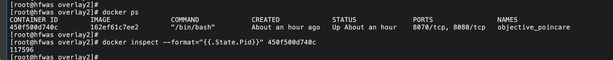
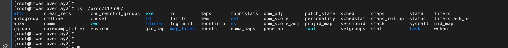

# docker进阶-进入容器

## 命令

- docker exec -it 

## 详解

- 查看容器进程id

- 查看进程所拥有的ns

- 有了这样一个可以“hold 住”所有 Linux Namespace 的文件，我们就可以对 Namespace 做一些很有意义事情了，比如：加入到一个已经存在的 Namespace 当中。
- 这也就意味着：一个进程，可以选择加入到某个进程已有的 Namespace 当中，从而达到“进入”这个进程所在容器的目的，这正是 docker exec 的实现原理。

## 原理

### setns

##  参考资料

- 极客时间深入剖析k8s