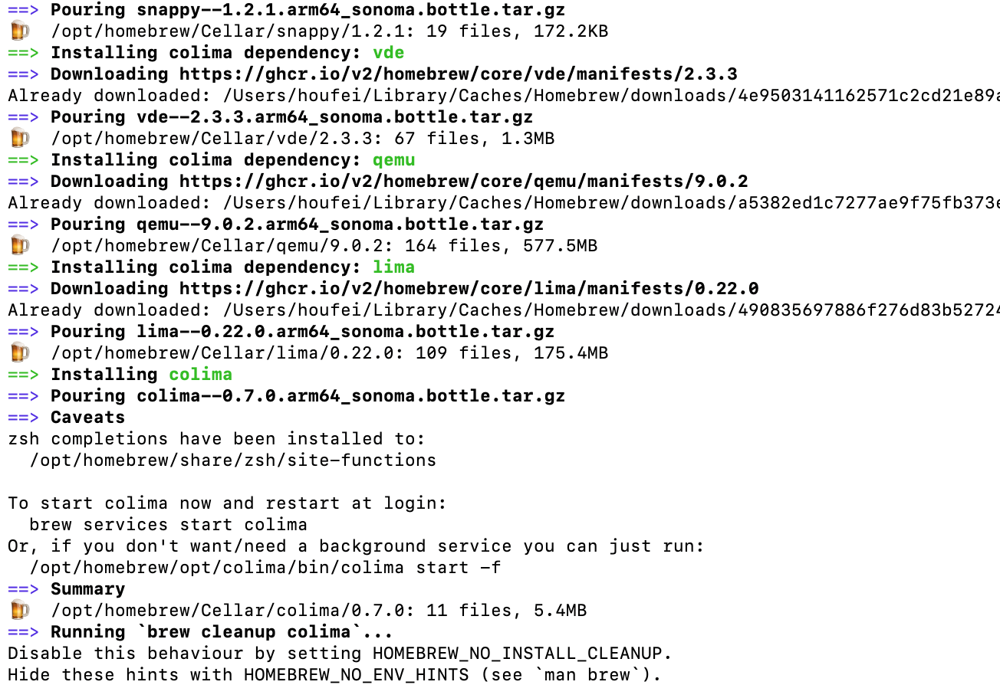
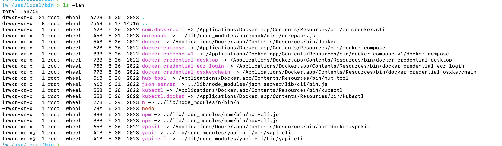

# Docker进阶知识-安装colima替代Docker Desktop

## 安装

- 执行`brew install docker-credential-helper docker`
- 执行`brew install colima`



- 卸载Docker同时kubectl命令会失效，原来的kubectl软连接是指向的Docker



- 安装kubectl，执行`brew install kubectl`
- 这样就可以使用kubectl命令了。
- colima启动前配置，可以通过`colima start -e`或者`vim $HOME/.colima/default/colima.yaml`

```bash
# 跳过私有仓库证书校验需添加如下字段
docker:
  insecure-registries:
  - 0.0.0.0/0
# 分配一个可访问的 IP 地址
netwrok:
  address: true  
```

- 启动colima,执行`colima start`,
- 查看启动的colima实例信息，执行`colima ls`

## 代理

- 安装完docker，拉取dockerhub镜像是拉取不了的，因为网络原因
- 我们还得给colima配置网络代理才可以正常拉取dockerhub镜像
- 执行`colima ssh`进入colima虚拟机当中，执行`ip route`查看eth0对应的IP地址，拿到192.168.5.2，如下：

```bash
houfei@colima:/Users/houfei/Downloads$ ip route 
default via 192.168.5.2 dev eth0 proto dhcp src 192.168.5.1 metric 100 
default via 192.168.106.1 dev col0 proto dhcp src 192.168.106.3 metric 100 
172.17.0.0/16 dev docker0 proto kernel scope link src 172.17.0.1 linkdown 
192.168.5.0/24 dev eth0 proto kernel scope link src 192.168.5.1 metric 100 
192.168.5.2 dev eth0 proto dhcp scope link src 192.168.5.1 metric 100 
192.168.106.0/24 dev col0 proto kernel scope link src 192.168.106.3 metric 100 
192.168.106.1 dev col0 proto dhcp scope link src 192.168.106.3 metric 100
```

- 因为博主使用的是clash，代理混合端口是7890，所以执行以下命令

```bash
export HTTP_PROXY='http://192.168.5.2:7890'
export HTTP_Proxy='http://192.168.5.2:7890'
```

- 然后就可以拉取镜像了，亲测可行！
