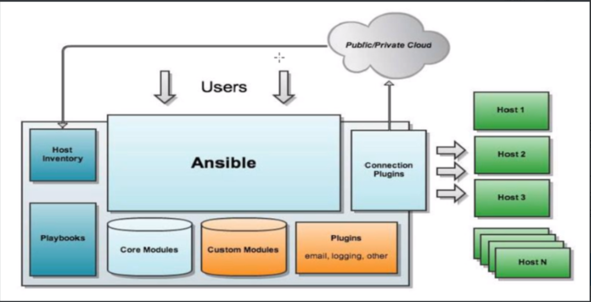
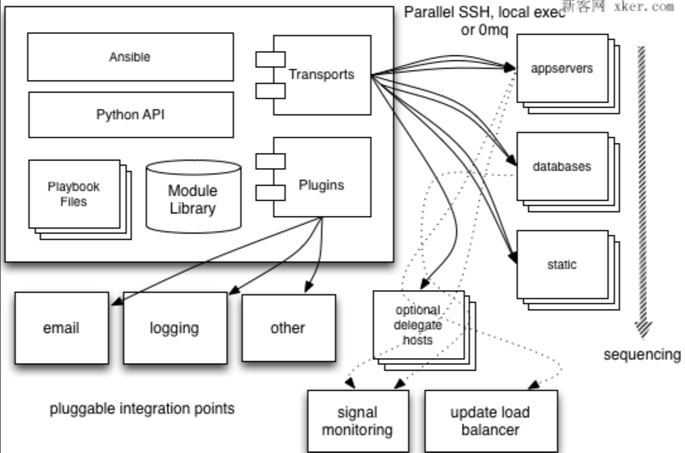

---
category:
  - ansible
tag:
  - ansible
---
# Ansible-基础知识

- 常用自动化运维工具
  - Ansible : python 
  - saltstack : python , 一版需要部署agent
  - puppet: ruby 功能强大，配置复杂，重型，适合大型环境
- 特性：
  - 模块化：调用特定的模块，完成特定任务
  - 有paramiko，pyaml，jinja2（模版语言）三个关键模块
  - 支持自定义模块
  - 基于python 语言实现
  - 部署简单，基于python和ssh，agentless
  - 安全，基于openssh
  - 支持基于platbook 编排任务
  - 幂等性：一个任务执行1遍和执行n遍效果一样，不因重复执行带来意外情况
  - 无需代理不依赖pki（无需ssl）
  - 可食用任何编程语言写模块
  - Yaml格式，编排任务，支持丰富的数据结构
  - 较强大的多层解决方案
- 架构

- 工作原理

- 主要组成部分
  - ansible platbook :任务剧本（任务集），编排定义ansible任务集的配置文件，由ansible顺序一次执行，通常是json格式的yaml文件
  - Inventory:ansible管理主机的清单/etc/ansible/hosts
  - modules:执行命令的功能模块，多数为内置核心模块，也可自定义
  - plugins:模块功能的补充，如连接类型插件，循环插件，变量插件，过滤插件等，该功能不常用
  - Api:供第三方程序调用的应用程序编程接口
  - ansible:组合Inventory，modules，Api，plugins的框，可以理解为是ansible命令工具，其为核心执行工具
- 命令执行来源
  - user，普通用户，即system administer
  - cmdb（配置管理数据库）API调用
  - public /private clooud api调用
  - user -> ansible playbook -> ansible
- 利用ansbile实现管理的方式
  - ad-hoc即ansible命令，主要用于临时命令使用场景，
  - ansible-playbook 主要用于长期规划好的，大型项目的场景，需要有前提的规划
- Ansible-playbook(剧本)执行过程：
  - 将已有编排好的任务集写入Ansible-Playbook
  - 通过ansible-playbook命令分拆任务集至逐条ansible命令，按预定规则逐条执行
- Ansible主要操作对象：
  - HOSTS主机
  - NETWORKING网络设备
- 注意事项
  - 执行ansible的主机一般称为主控端，中控，master或堡垒机
  - 主控端Python版本需要2.6或以上
  - 被控端Python版本小于2.4需要安装python-simplejson
  - 被控端如开启SELinux需要安装libselinux~python
  - windows7不能做为主控端

- Ansible 配置文件

  - Ansible配置文件/etc/ansible/ansible.cfg(一般保持默认)
  - [defaults]
    - #inventory=/etc/ansible/hosts#主机列表配置文件
    - #library=/usr/share/my_modules/,#库文件存放目录
    - #remote_.tmp=$HOME/.ansible/tmp#临时py命令文件存放在远程主机目录
    - #local_tmp=$HOME/.ansible/tmp#本机的临时命令执行目录
    - #forks=5#默认并发数
    - #sudo_user=root#默认sudo用户
    - #ask_sudo_pass=True#每次执行ansible命令是否询问ssh密码
    - #ask_pass True
    - #remote_port =22
    - #host_key_checking=False#检查对应服务器的host_key,建议取消注释
    - #log_path=/var/log/ansible.log#日志文件

  
