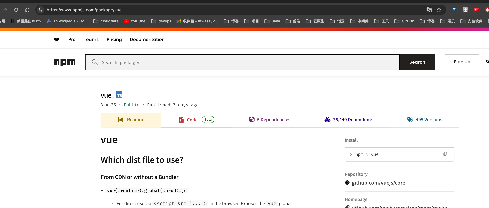
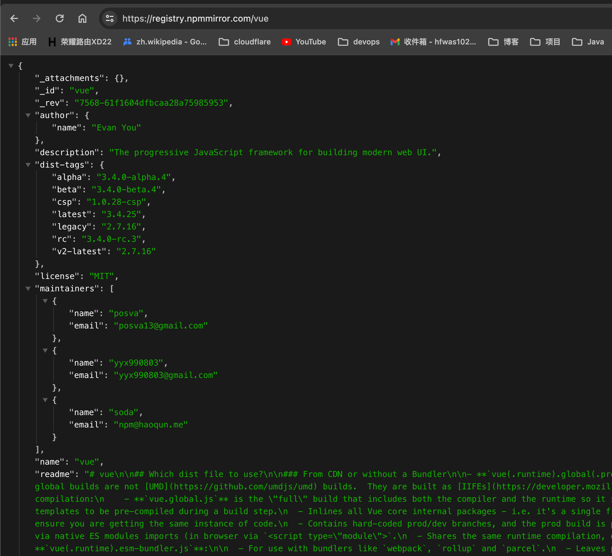

---
category:
  - nexus
tag:
  - nexus
---
# Nexus操作-前端依赖管理工具

- 前端主要有四种依赖管理方式， 分别是npm, yarn, pnpm

- 对应的依赖约束文件分别是

  - npm对应的是：执行`npm install`之后，项目路径下会生成package-lock.json文件，文件当中指定了依赖的版本
  - yann对应的是：执行`yarn install`之后，项目路径会生成yarn.lock文件，同理，文件当中指定了了依赖的版本，
    - 但是yarn.lock文件有点特殊，内容有些差异，有些当中依赖带有resoluted字段，有些带有resolutuon字段，基于这个区别，所有会有两种脚本
  - pnpm 对应的是：执行`pnpm install`之后，会生成pnpm-lock.yaml文件，

- 前端依赖下载逻辑：

  - 基于依赖管理工具生成的依赖约束文件，比如yarn.lock文件，文件当中有项目下所有的依赖的约束版本和依赖名称，我们通过解析yarn.lock文件内容，获取到所有的依赖名称，
  - 前端有自己的统一依赖库，那就是[npmjs](https://www.npmjs.com/package/vue)，获取了依赖名称之后，就可以去下载依赖的所有版本，然后上传到内网nexus

  

- npmjs的依赖管理

  - 依赖仓库地址是：`https://registry.npmmirror.com`
  - 获取依赖的所有版本：仓库地址/依赖名称，访问可以获取到依赖的描述文件，其中包含了依赖的所有版本信息，我们要做的事提取依赖的所有版本号，然后遍历下载所有版本到本地即可。示例：`https://registry.npmmirror.com/vue`

  

  - 依赖的路径规则是：仓库地址/依赖名称/版本/-/文件名称，
    - 文件名称通常是：依赖名称-版本.tgz