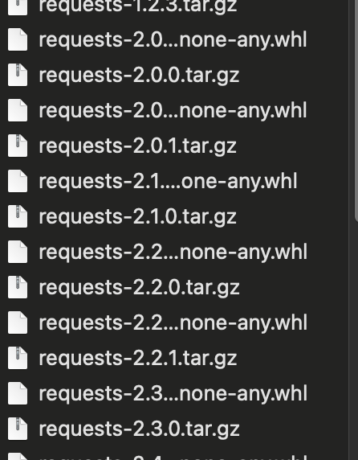

---
category:
  - nexus
tag:
  - nexus
---
# Nexus操作-下载公网python依赖

- 注意：内网情况下，无法链接互联网，nexus无法使用公网python依赖，所以需要将公网依赖同步到内网，可以使用此方法。
- 新建脚本`python-download-whl.sh`，脚本内容如下所示：

```
#!/bin/bash

mkdir python
# 包名称
package_name="requests"

# 构建PyPI API查询URL
pypi_api_url="https://pypi.org/pypi/$package_name/json"

# 下载目录
download_dir="./python"

# 确保下载目录存在
mkdir -p "$download_dir"

# 使用curl获取包信息的JSON数据
response=$(curl -s "$pypi_api_url")

# 提取所有版本的.whl文件下载链接
versions=$(echo "$response" | jq -r '.releases | keys[]')

# 遍历每个版本，获取并下载.whl文件
for version in $versions; do
    whl_urls=$(echo "$response" | jq -r ".releases[\"$version\"][] | .url")
    
    # 下载每个版本的.whl文件
    for whl_url in $whl_urls; do
        echo "正在下载 $whl_url..."
        wget -q -P "$download_dir" "$whl_url"
    done
done

echo "下载完成."
```

- 执行脚本`./python-download-whl.sh`，下载内容如下所示：



- 下载python依赖完成！！