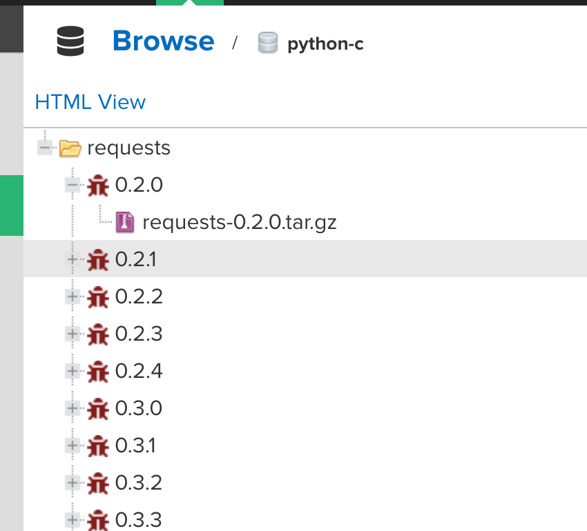

---
category:
  - nexus
tag:
  - nexus
---

# Nexus操作-上传python依赖

- 注意：内网情况下，无法链接互联网，nexus无法使用公网python依赖，所以需要将公网依赖同步到内网，可以使用此方法。
- 新建脚本`pythonimport.sh`

```bash
#!/bin/bash
# 获取命令行参数
while getopts ":r:u:p:" opt; do
    case $opt in
        r) NEXUS_URL="$OPTARG"
        ;;
        u) NEXUS_USERNAME="$OPTARG"
        ;;
        p) NEXUS_PASSWORD="$OPTARG"
        ;;
    esac
done
# find 并批量上传
find . -type f \( -name '*.tgz' -o -name '*.tar.gz' -o -name '*.whl' \)  | sed "s|^\./||" | xargs -I '{}' \
curl -u "$NEXUS_USERNAME:$NEXUS_PASSWORD" -X 'POST' -v \
  ${NEXUS_URL} \
  -H 'accept: application/json' \
  -H 'Content-Type: multipart/form-data' \
  -F 'npm.asset=@{};type=application/x-compressed' ;
```

- 新建脚本`pythonpush.sh`

```bash
#!/bin/bash
workDir=$(dirname "$PWD")
#repoDir=$workDir/repo
repoDir=/Users/hfwas/Downloads/python
# 将此脚本mavenimport.sh 复制并运行到包含文件的存储库目录的根目录

cp pythonimport.sh $repoDir/pythonimport.sh
chmod -R 777 $repoDir/pythonimport.sh
cd $repoDir && ./pythonimport.sh -u admin -p Ab123456 -r http://nexusip:端口/service/rest/v1/components?repository=python-c
```

- 执行脚本`./pythonpush.sh`
- nexus当中hosted类型python仓库效果如下：



- 上传python依赖完成！！