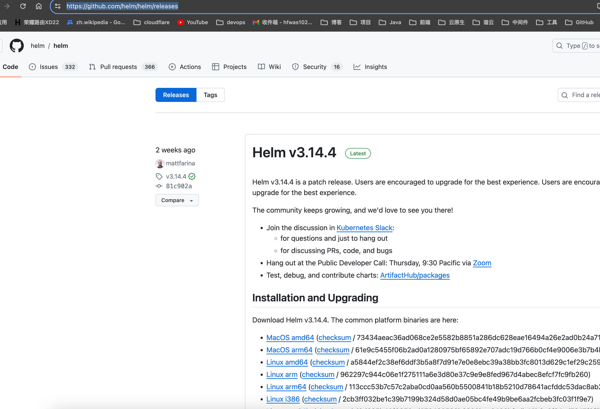
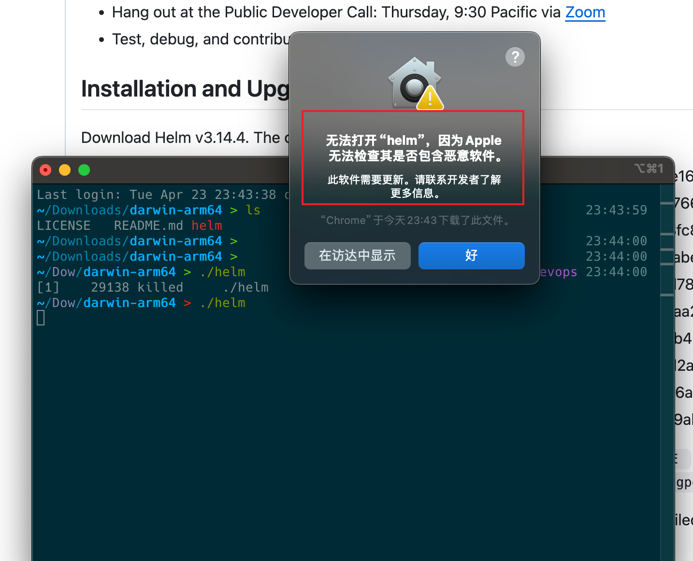
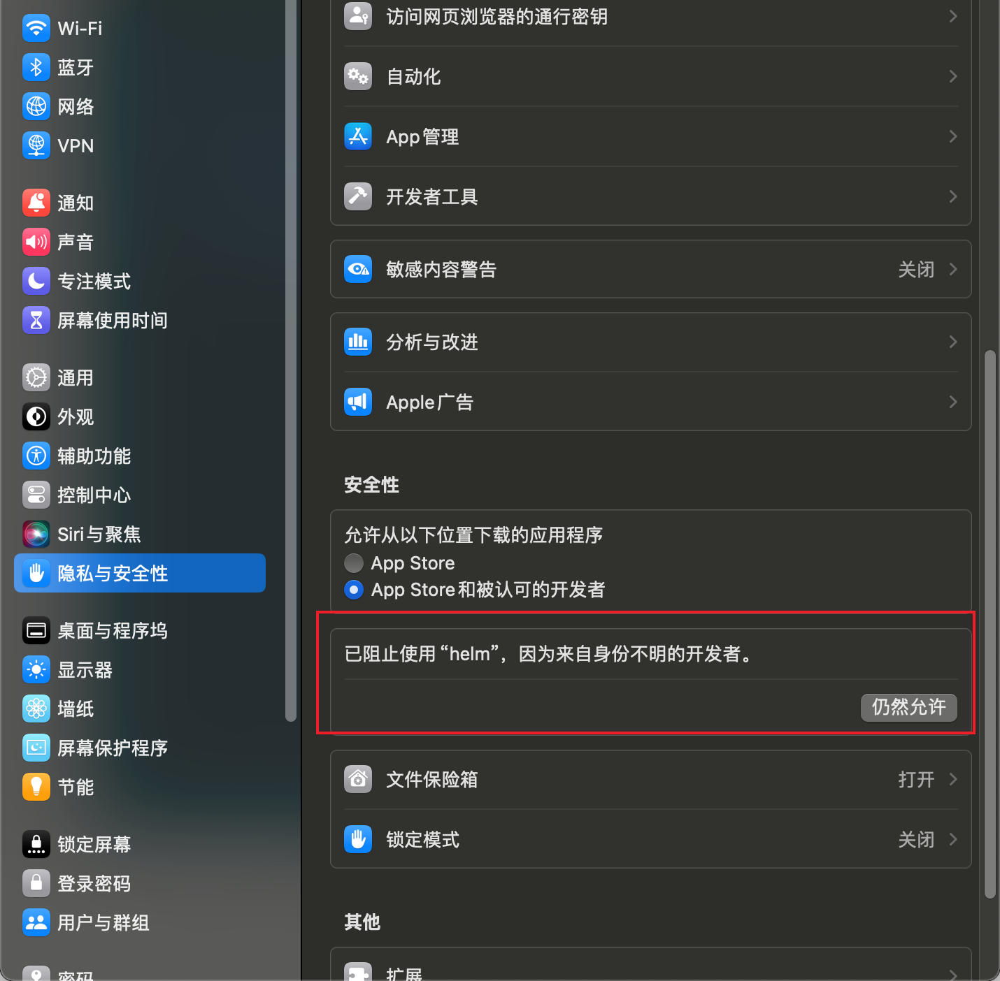
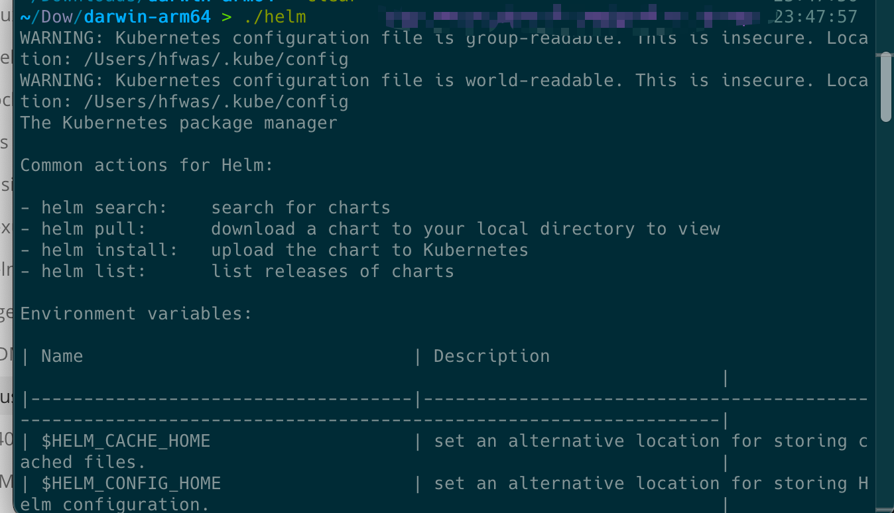

# 安装使用helm

- 访问GitHub helm的发版管理页面，地址：`https://github.com/helm/helm/releases`，下载对应的平台安装包下载即可

- 解压缩压缩包，然后执行`./helm`查看是否有命令提示，这里我是用的是mac，会有下属的提示：

- 打开设置，隐私与安全性，会看到这样一条信息，点击允许执行，提示输入密码，然后就可以使用helm：

- 再次执行`./helm`命令，会提示命令帮助信息：

- 这里就可以开始使用helm了