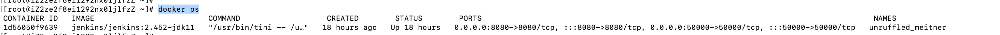
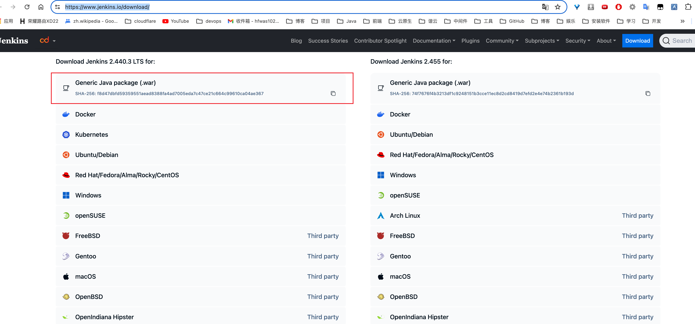

# Jenkins-部署

## docker部署

- 执行`docker pull jenkins/jenkins:2.452-jdk11`
- 执行`docker run -u root -d -p 8080:8080 -p 50000:50000 -v /root/jenkins:/var/jenkins_home -v /var/run/docker.sock:/var/run/docker.sock -v /usr/bin/docker:/usr/bin/docker --privileged=true jenkins/jenkins:2.452-jdk11`
- 执行`docker ps`，查看jenkins容器是否启动起来

- 注意点：
  - 必须使用高版本的jenkins，否则启动起来之后安装推荐插件大部分插件会安装失败，对jenkins版本有要求
  - 如果流水线当中需要使用agent-docker启动构建agent，那么需要将虚拟机上的docker命令做挂载，以便jenkins容器当中可以使用docker命令
  - 启动方式需要使用`--privileged=true`不然会报错权限不足的问题
  - 一定要将`/var/jenkins_home`路径挂载出来到虚拟机上，方便数据存储和数据迁移

## jar包部署

- 访问`https://www.jenkins.io/download/`选择war包下载，

- 传输到服务器上，执行`java -jar war包名称`即可