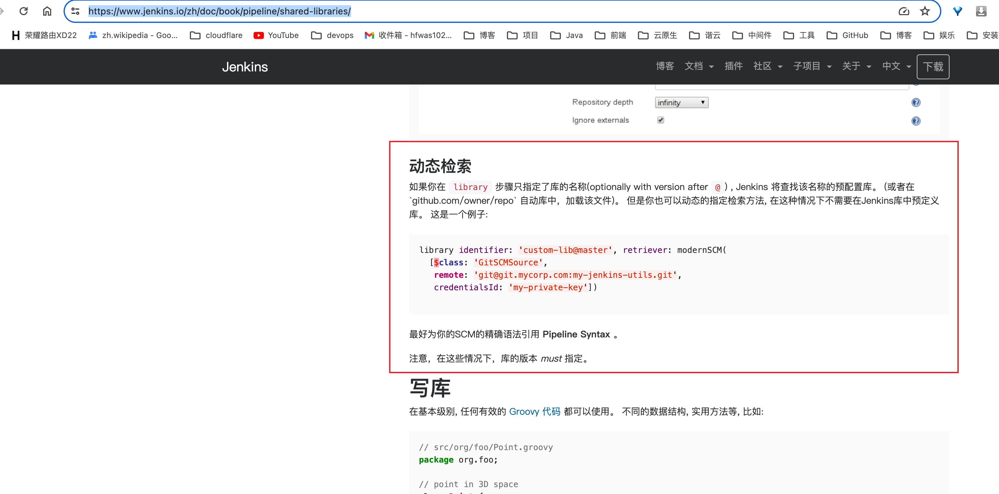
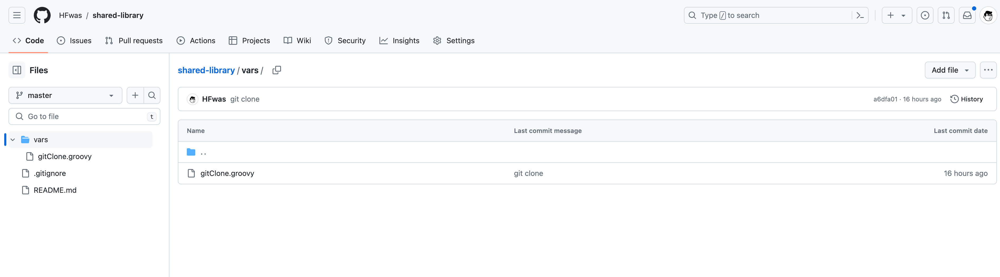
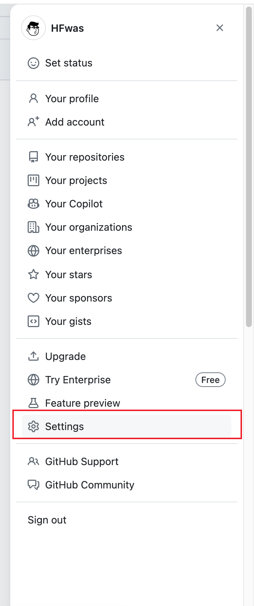
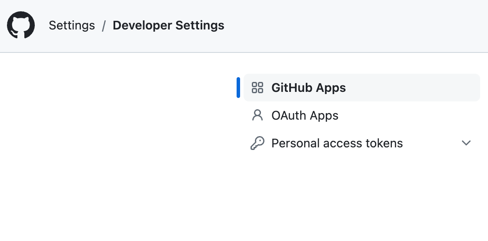
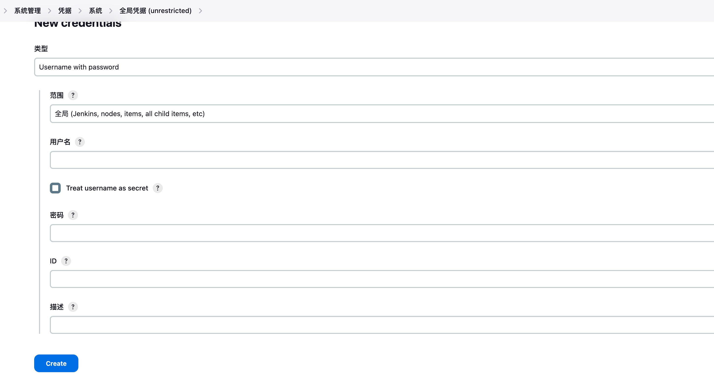
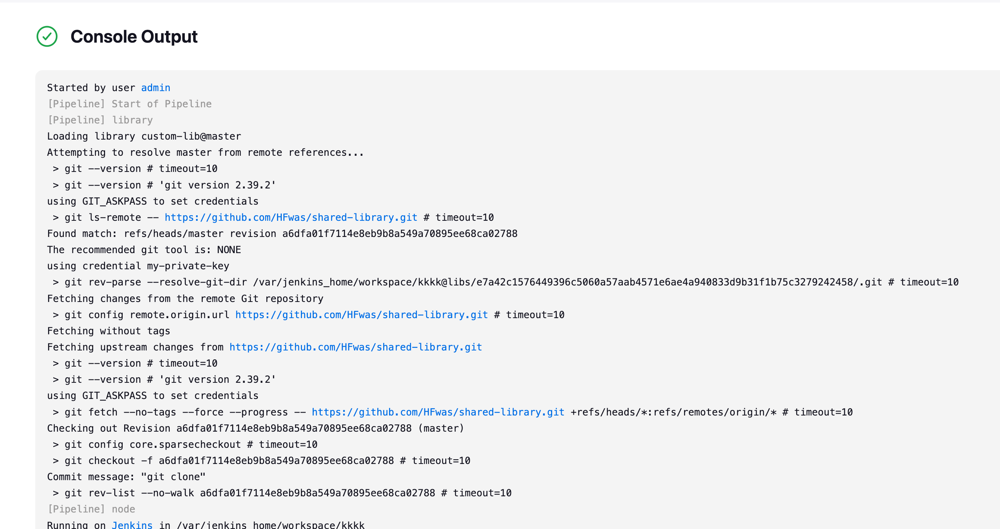

---
category:
  - jenkins
tag:
  - jenkins
---

# Jenkins-sharaed-library共享插件库

- 由于流水线被组织中越来越多的项目所采用，常见的模式很可能会出现。 在多个项目之间共享流水线有助于减少冗余，流水线支持创建 "共享库" ，可以在外部源代码控制仓库中定义并加载到现有的流水线中。
- 这里我们使用插件库的动态检索模式，参考jenkins[官方文档](https://www.jenkins.io/zh/doc/book/pipeline/shared-libraries/)



- 接下来我们要新建一个共享代码库，登陆github,新建仓库，新建vars文件夹，定一个方法，如下图所示：



- 新建github用户的访问凭据，登陆GitHub,进入用户设置界面



- 左下侧有一个开发者设置，进入之后，选择个人访问token,新建一个token，



- 拿到github生成的token，登陆jenkins，选择系统管理-凭据-系统-全局凭据-新建全局凭据，选择username-password类型，用户名就是github 用户名称，密码是个人访问token



- 然后流水线当中就可以使用我们定义的shard-library库了
- 新建一条流水线，选择流水线类型，点击配置，左侧菜单选择流水线，在流水线顶部添加如下：

```
library identifier: 'custom-lib@master', retriever: modernSCM([
    $class: 'GitSCMSource',
    remote: 'https://github.com/HFwas/shared-library.git',
    credentialsId: 'my-private-key'
])
pipeline {
```

- 然后执行流水线，可以看到控制台有这样的输出，说明流水线主动拉取了shard-library库



- 然后接下来就可以在vars文件夹当中新建各种子步骤，提供给流水线使用
- 完成！！

