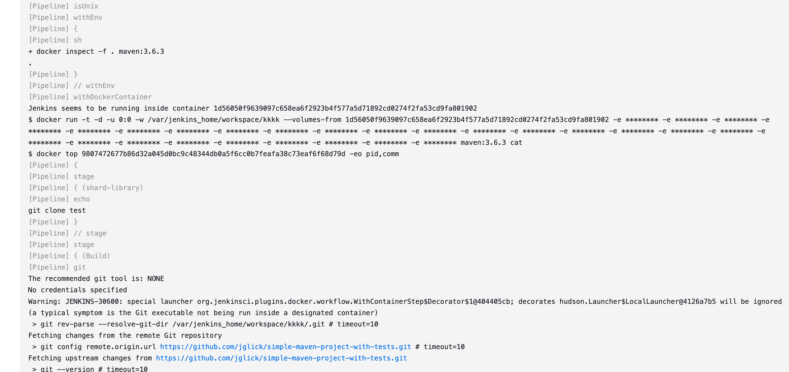

---
category:
  - jenkins
tag:
  - jenkins
---

# Jenkins-agent

## docker-agent

- jenkins提供了docker作为流水线的运行环境，
- 启动流水线之后，jenkins会在配置的虚拟机当中启动一个docker容器来作为接下来流水线步骤的运行环境，当然也可以不同步骤定义不同的运行环境
- 参考jenkisn官网，需要在jenkins当中填写agent选项，值为docker，指定容器镜像

```groovy
pipeline {
    agent {
        docker { image 'node:7-alpine' }
    }
    stages {
        stage('Test') {
            steps {
                sh 'node --version'
            }
        }
    }
}
```

- 我们这里以jenkins提供的流水线模版为例说明docker作为agent
- 在流水线当中配置agent,添加几个子步骤，完整的jenkinsfile如下所示：

```
library identifier: 'custom-lib@master', retriever: modernSCM([
    $class: 'GitSCMSource',
    remote: 'https://github.com/HFwas/shared-library.git',
    credentialsId: 'my-private-key'
])
pipeline {
    agent {
        docker {
            image 'maven:3.6.3'
        }
    }

    stages {
        stage('shard-library') {
            steps {
                gitClone("","","","")
            }
        }
        stage('Build') {
            steps {
                // Get some code from a GitHub repository
                git 'https://github.com/jglick/simple-maven-project-with-tests.git'

                // Run Maven on a Unix agent.
                sh "mvn -Dmaven.test.failure.ignore=true clean package"

                // To run Maven on a Windows agent, use
                // bat "mvn -Dmaven.test.failure.ignore=true clean package"
            }

            post {
                // If Maven was able to run the tests, even if some of the test
                // failed, record the test results and archive the jar file.
                success {
                    junit '**/target/surefire-reports/TEST-*.xml'
                    archiveArtifacts 'target/*.jar'
                }
            }
        }
    }
}

```

- 启动构建流水线，在控制台输出当中可以看到jenkins为我们新建一个docker容器，使用的是`maven:3.6.3`这个镜像



- 然后在容器当中执行maven构建和单元测试这些步骤
- Docker-agent也可以支持挂载，将下载的依赖挂载到虚拟机当中，这样提高了构建速度，不用每次都下载依赖

```
pipeline {
    agent {
        docker {
            image 'maven:3.6.3'
            args '-v $HOME/.m2:/root/.m2'
        }
    }
```

- 这样在我们的虚拟机的`$HOME/.m2`路径下可以看到项目构建拉取的依赖


## pod-agent