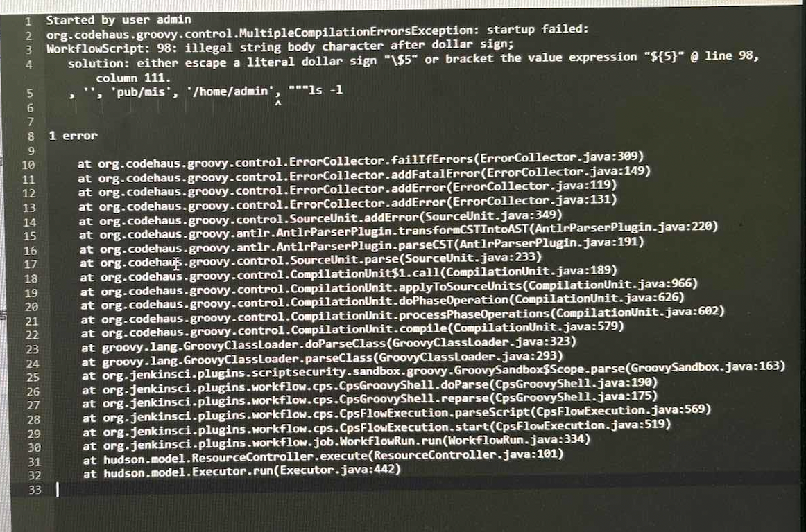

# Jenkins常见报错

## illegal string body character after dollar sign

- 今天遇到了一个问题，报错截图如下`WorkflowScript: 98: i1legal string body character after dollar sign`

- 解决办法：

  - 将流水线涉及特殊字符的`"""`修改为`'''`，将shell命令包围的修改一下

- 参考链接
  - https://stackoverflow.com/questions/55454137/jenkinsfile-illegal-string-body-character-after-dollar-sign-solution-either-e

## package.json当中使用的是fetk打包，执行npm install报错

- 原因；fetk版本在0.5.8以下的在linux构建环境中有问题，会导致卡死，linux上有问题，0.2.8的fetk里的fetk.js第一行#!/usr/bin/env node --max_old_space_size=4096 这里会卡住，后续版本把--max_old_space_size=4096去掉就可以在linux上跑了
- 排查：查看package-lock.json或者yarn.lock当中fetk依赖的版本号是多少，
  - fetk version<0.5.8

- 解决办法：
  - 升级fetk版本，至少大于0.5.8

