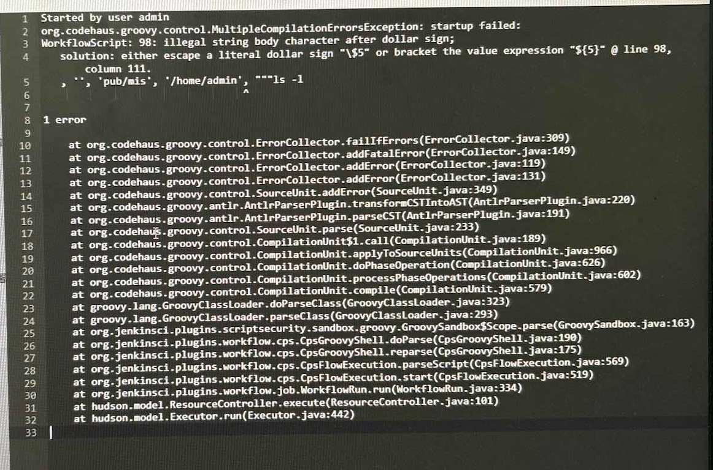

# jenkins常见问题-illegal string body character after dollar sign

- 今天遇到了一个问题，报错截图如下`WorkflowScript: 98: i1legal string body character after dollar sign`

- 解决办法：

  - 将流水线涉及特殊字符的`"""`修改为`'''`，将shell命令包围的修改一下

## 参考链接

- https://stackoverflow.com/questions/55454137/jenkinsfile-illegal-string-body-character-after-dollar-sign-solution-either-e