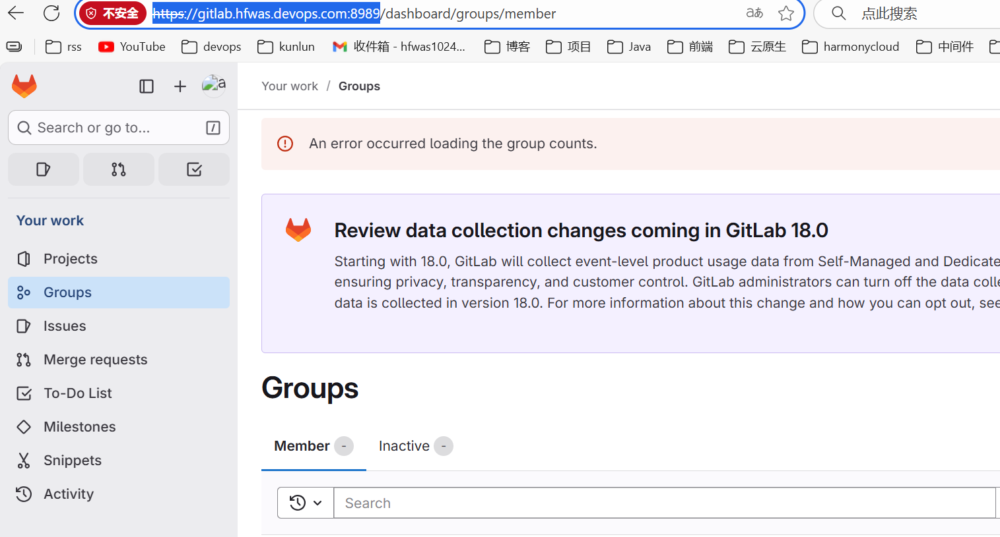

# Gitlab-支持https加域名访问

环境：windows操作系统

镜像地址：swr.cn-north-4.myhuaweicloud.com/ddn-k8s/docker.io/gitlab/gitlab-ce:18.5.2-ce.0

## 安装

启动命令：

```bash
docker run -d --name gitlab --restart always -p 8080:80 -p 8443:443 -p 2222:22 -v /e/docker/gitlab/config:/etc/gitlab -v /e/docker/gitlab/logs:/var/log/gitlab -v /e/docker/gitlab/data:/var/opt/gitlab -e TZ="Asia/Shanghai" swr.cn-north-4.myhuaweicloud.com/ddn-k8s/docker.io/gitlab/gitlab-ce:18.5.2-ce.0
```

访问地址：[http://localhost:8080](http://localhost:8080/)

查看初始化密码：

/etc/gitlab/initial_root_password

```bash
$ winpty docker exec -it 0c855526d72e bash
root@0c855526d72e:/# cat /etc/gitlab/initial_root_password
# WARNING: This password is only valid if ALL of the following are true:
#          • You set it manually via the GITLAB_ROOT_PASSWORD environment variable
#            OR the gitlab_rails['initial_root_password'] setting in /etc/gitlab/gitlab.rb
#          • You set it BEFORE the initial database setup (typically during first installation)
#          • You have NOT changed the password since then (via web UI or command line)
#
#          If this password doesn't work, reset the admin password using:
#          https://docs.gitlab.com/security/reset_user_password/#reset-the-root-password

Password: 796Nkh/lOeKl3T6LGZZJPfPwGrx+BZVAQQdamd0e3dg=

# NOTE: This file is automatically deleted after 24 hours on the next reconfigure run.
```

## https+域名访问

本地配置host映射

```bash
127.0.0.1 gitlab.hfwas.devops.com
```

新增certs文件夹，生成证书

```bash
hfwas@houfei MINGW64 /e/docker/gitlab/certs
$ openssl req -newkey rsa:4096 -nodes -sha256 -keyout gitlab.hfwas.devops.com.key -x509 -days 365 -out gitlab.hfwas.devops.com.crt
..............+........+...+....+.....+.+..+....+.....+....+......+...+..........................+.+......+..+.+...........+
-----
You are about to be asked to enter information that will be incorporated
into your certificate request.
What you are about to enter is what is called a Distinguished Name or a DN.
There are quite a few fields but you can leave some blank
For some fields there will be a default value,
If you enter '.', the field will be left blank.
-----
Country Name (2 letter code) [AU]:Shanghai
String too long, must be at most 2 bytes long
Country Name (2 letter code) [AU]:CN
State or Province Name (full name) [Some-State]:Shanghai
Locality Name (eg, city) []:Shanghai
Organization Name (eg, company) [Internet Widgits Pty Ltd]:hfwas
Organizational Unit Name (eg, section) []:devops
Common Name (e.g. server FQDN or YOUR name) []:gitlab.hfwas.devops.com
Email Address []:demo@163.com
```

新建gitlab.rb文件，增加这几行内容：

```bash
external_url 'https://gitlab.hfwas.devops.com:8443'
nginx['ssl_certificate'] = '/etc/gitlab/ssl/gitlab.hfwas.devops.com.crt'
nginx['ssl_certificate_key'] = '/etc/gitlab/ssl/gitlab.hfwas.devops.com.key'
nginx['redirect_http_to_https'] = true
```

新建docker-compose文件：

```bash
version: '3.6'
services:
  gitlab:
    image: swr.cn-north-4.myhuaweicloud.com/ddn-k8s/docker.io/gitlab/gitlab-ce:18.4.0-ce.0
    container_name: gitlab
    restart: always
    hostname: localhost
    ports:
      - "8989:8443"  # 网页访问端口映射
      - "2222:22"    # SSH端口映射
    volumes:
      # 核心：直接挂载本地gitlab.rb到容器内的配置路径
      - E:/docker/gitlab/gitlab.rb:/etc/gitlab/gitlab.rb
      # 保留其他目录的持久化挂载（配置、数据、日志）
      - E:/docker/gitlab/config:/etc/gitlab
      - E:/docker/gitlab/data:/var/opt/gitlab
      - E:/docker/gitlab/logs:/var/log/gitlab
    deploy:
      resources:
        limits:
          memory: 4G
```

启动gitlab：

```bash
docker-compose up -d 
```

查看初始化密码：

```bash
docker exec -it gitlab bash 
cat /etc/gitlab/initial_root_password
```

访问：https://gitlab.hfwas.devops.com:8989/

效果如下：


