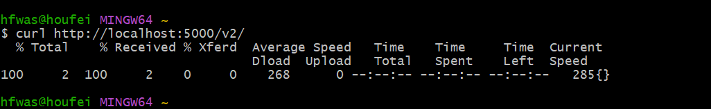

# registry-本地docker启动

注意：我这里使用的我windows电脑做的测试，linux/mac需要修改命令

拉取依赖：

```bash
docker pull swr.cn-north-4.myhuaweicloud.com/ddn-k8s/docker.io/library/registry:3.0.0
```

启动registry:

```bash
docker run -d --name docker-registry --restart always -p 5000:5000 -v /e/docker/registry:/var/lib/registry swr.cn-north-4.myhuaweicloud.com/ddn-k8s/docker.io/library/registry:3.0.0
```

查看容器挂载：

```bash
$ docker inspect docker-registry --format '{{ .Mounts }}'
[{bind  E:\docker\registry;D \Git\var\lib\registry   true rprivate} {volume a8e20b0c975997adacb5f4edc70e3fd0daa35dff0c50c32f5962cc2a7a1b1bfe /var/lib/docker/volumes/a8e20b0c975997adacb5f4edc70e3fd0daa35dff0c50c32f5962cc2a7a1b1bfe/_data /var/lib/registry local  true }]
```

本地curl查看：

```bash
curl http://localhost:5000/v2/
```

结果如下：



本地测试推送镜像到registry:

```bash
 docker tag swr.cn-north-4.myhuaweicloud.com/ddn-k8s/docker.io/library/registry:3.0.0 localhost:5000/tools/registry:3.0.0
 docker push localhost:5000/tools/registry:3.0.0
```

执行命令查看：

```bash
curl http://localhost:5000/v2/_catalog
```

结果如下：

.png)