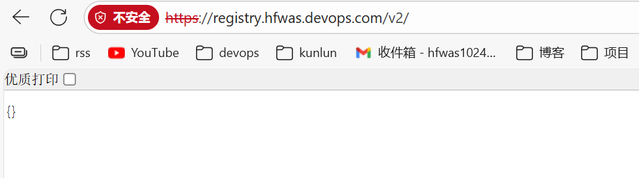

# registry-支持https加域名访问

注意：我这里使用的我windows电脑做的测试，linux/mac需要修改命令

本地配置host映射：

```bash
127.0.0.1 registry.hfwas.devops.com
```

新建证书文件夹：E:\docker\registry\certs

windows使用gitbash打开这个文件夹，gitbash自带openssl命令

```bash
openssl req -newkey rsa:4096 -nodes -sha256 -keyout registry.hfwas.devops.com.key -x509 -days 365 -out registry.hfwas.devops.com.crt
```

执行生成证书交互性：

```bash
hfwas@houfei MINGW64 /e/docker/registry/certs
$ openssl req -newkey rsa:4096 -nodes -sha256 -keyout registry.hfwas.devops.com.key -x509 -days 365 -out registry.hfwas.devops.com.crt
....+.+........+......+.+..+.+..+.......+.....+.+.....+++++++++++++++++++++++++++++++++++++++++++++*....+...........+....+++++++++++++++++++++++++++++++++++++++++++++*............+..........+..+.........+.+..................+...........+......+.+..+.
-----
You are about to be asked to enter information that will be incorporated
into your certificate request.
What you are about to enter is what is called a Distinguished Name or a DN.
There are quite a few fields but you can leave some blank
For some fields there will be a default value,
If you enter '.', the field will be left blank.
-----
Country Name (2 letter code) [AU]:CN
State or Province Name (full name) [Some-State]:Shanghai
Locality Name (eg, city) []:Shanghai
Organization Name (eg, company) [Internet Widgits Pty Ltd]:hfwas
Organizational Unit Name (eg, section) []:devops
Common Name (e.g. server FQDN or YOUR name) []:registry.hfwas.devops.com
Email Address []:hfwas1024@163.com
```

powershell当中执行启动容器：

```
docker run -d --name docker-registry --restart always -p 443:443 -v E:\docker\registry\data:/var/lib/registry -v E:\docker\registry\certs:/certs -e REGISTRY_HTTP_TLS_CERTIFICATE=/certs/registry.hfwas.devops.com.crt -e REGISTRY_HTTP_TLS_KEY=/certs/registry.hfwas.devops.com.key -e REGISTRY_HTTP_ADDR=0.0.0.0:443 swr.cn-north-4.myhuaweicloud.com/ddn-k8s/docker.io/library/registry:3.0.0 
```

关键参数：

- `REGISTRY_HTTP_TLS_CERTIFICATE`/`REGISTRY_HTTP_TLS_KEY`：指定容器内证书和私钥的路径（对应挂载的`/certs`目录）。
- `REGISTRY_HTTP_ADDR=0.0.0.0:443`：让 Registry 在容器内监听 443 端口，对外映射到主机 443 端口。
- 若 443 端口被占用（如 Jenkins、Nexus、GitLab），可替换为其他端口（如`-p 8445:443`），后续访问需加端口（如`https://registry.hfwas.devops.com:8445`）。

浏览器访问测试：https://registry.hfwas.devops.com/v2/

