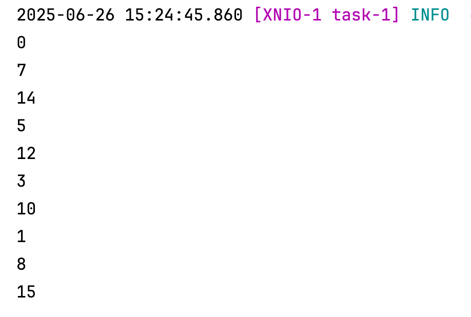

# JUC-``ThreadLocal详解``

## 简单实用
- 提供一个简单例子来使用 ThreadLocal
- 声明 ThreadLocal，比如：`private static final ThreadLocal<Object> threadLocal = new NamedThreadLocal<>("logs");`
- 先暂时省略 set 步骤，当需要 threadLocal 的时候，我们通常是：threadLocal.get()

## threadLocal.get()
- 先看代码：
```java
public T get() {
    Thread t = Thread.currentThread();
    ThreadLocalMap map = getMap(t);
    if (map != null) {
        ThreadLocalMap.Entry e = map.getEntry(this);
        if (e != null) {
            @SuppressWarnings("unchecked")
            T result = (T)e.value;
            return result;
        }
    }
    return setInitialValue();
}
ThreadLocalMap getMap(Thread t) {
    return t.threadLocals;
}
public class Thread implements Runnable {
    /* ThreadLocal values pertaining to this thread. This map is maintained
     * by the ThreadLocal class. */
    ThreadLocal.ThreadLocalMap threadLocals = null;
}
```
- 从代码可以看到，每个线程维护了自己的 ThreadLocal.ThreadLocalMap threadLocals 变量，从 ThreadLocal 当中获取数据，
- 本质上是以当前线程作为 key 从 ThreadLocalMap 获取 ThreadLocalMap.Entry 对象，说明 value 存储的是 Entry

## `ThreadLocal`数据结构
- Thread 类内部维护了一个 `ThreadLocal.ThreadLocalMap` 类型的 threadLocals 变量，也就是每个线程有自己独立的 threadLocals。
- ThreadLocalMap 可以简单理解成以 ThreadLocal 作为 key，, value 是我们存储的值。
- 小知识点：ThreadLocalMap 当中 key 其实不是 ThreadLocal 本身，其实是一个弱引用。
- 代码可以参考 ThreadLocal.set方法

## ThreadLocal.set方法
ThreadLocal.set 方法获取当前线程，以当前线程作为 key，从 ThreadLocalMap 获取，如果 ThreadLocalMap 存在就set值，如果 ThreadLocalMap 不存在就创建
代码如下：
```java
public void set(T value) {
    Thread t = Thread.currentThread();
    ThreadLocalMap map = getMap(t);
    if (map != null) {
        map.set(this, value);
    } else {
        createMap(t, value);
    }
}
void createMap(Thread t, T firstValue) {
    t.threadLocals = new ThreadLocalMap(this, firstValue);
}    
```
## ThreadLocalMap.set方法
### index 计算
- 从 ThreadLocal.set 方法可以看到，如果 ThreadLocalMap 存在，会将当前值存入 ThreadLocalMap，具体的细节在 ThreadLocalMap.set 当中，
- 在 ThreadLocalMap.set 当中有一个细节，计算下标 index 的方法，ThreadLocalMap 本质上还是一个 Map 结构，需要计算 key 的 hash 值，具体的计算逻辑如下：
代码如下：
```java
int i = key.threadLocalHashCode & (len-1);

private static final int HASH_INCREMENT = 0x61c88647;

private final int threadLocalHashCode = nextHashCode();

private static int nextHashCode() {
    return nextHashCode.getAndAdd(HASH_INCREMENT);
}
```
可以执行下这个代码，看看计算出来的的 index 有什么规律：
代码如下：
```java
AtomicInteger nextHashCode = new AtomicInteger();
for (int i = 0; i < 10; i++) {
    int andAdd = nextHashCode.getAndAdd(0x61c88647) & 15;
    System.out.println(andAdd);
}
```
执行结果如下：




## ThreadLocal.get方法

## ThreadLocal hash冲突

## ThreadLocal key清理

