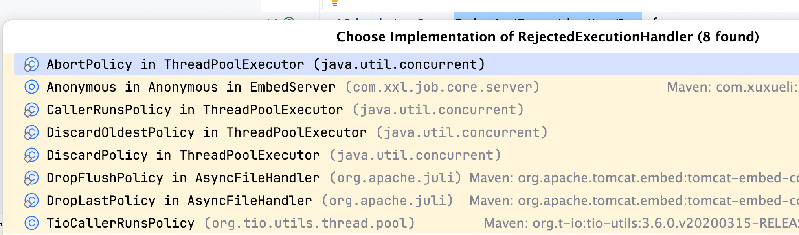

# JUC-线程池详解
## 创建线程池

- 通过 Executor 框架的工具类 Executors 创建线程池
- 通过 ThreadPoolExecutor 构造函数创建

## ThreadPoolExecutor

### 构造函数

- ThreadPoolExecutor 有七个参数，其中核心参数有三个：
  - corePoolSize：核心线程数量
  - maximumPoolSize：最大线程池数量
  - workQueue：工作队列
- 其他参数：
  - keepAliveTime：空闲线程存活时间
  - unit：keepAliveTime 参数的单位
  - threadFactory：线程工厂
  - handler：线程的拒绝策略

```java
public ThreadPoolExecutor(int corePoolSize,
                              int maximumPoolSize,
                              long keepAliveTime,
                              TimeUnit unit,
                              BlockingQueue<Runnable> workQueue,
                              ThreadFactory threadFactory,
                              RejectedExecutionHandler handler) {
        if (corePoolSize < 0 ||
            maximumPoolSize <= 0 ||
            maximumPoolSize < corePoolSize ||
            keepAliveTime < 0)
            throw new IllegalArgumentException();
        if (workQueue == null || threadFactory == null || handler == null)
            throw new NullPointerException();
        this.corePoolSize = corePoolSize;
        this.maximumPoolSize = maximumPoolSize;
        this.workQueue = workQueue;
        this.keepAliveTime = unit.toNanos(keepAliveTime);
        this.threadFactory = threadFactory;
        this.handler = handler;

        String name = Objects.toIdentityString(this);
        this.container = SharedThreadContainer.create(name);
    }
```


### 线程池线程执行逻辑
- 如果线程数量 < corePoolSize，创建线程执行
- 如果线程 >= corePoolSize, 放入任务队列
- 如果队列满了，且 < maximumPoolSize，创建线程执行
- 队列满了，且 > maximumPoolSize，执行拒绝策略


### 拒绝策略
拒绝策略有如下几种：
- AbortPolicy：直接抛出 RejectedExecutionException 异常
- CallerRunsPolicy：线程还没有关闭的情况下，会直接调用`run`方法去处理任务。线程关闭情况下，会直接抛弃任务
- DiscardOldestPolicy：丢弃最早的未处理的任务请求
- DiscardPolicy：不处理，直接丢弃掉
- 剩下三种拒绝策略 ThreadPoolExecutor 没有实现，但是可以了解一下。
  - DropFlushPolicy：
  - DropLastPolicy：
  - TioCallerRunsPolicy：
- 这些拒绝策略都实现了 RejectedExecutionHandler，可以从代码层级结构当中看到；




## Executors 工具类

提供了几种常见的内置线程池：

- newFixedThreadPool：创建固定线程数量的线程池
- newSingleThreadExecutor：创建单一线程的线程池
- newCachedThreadPool：创建缓存的线程池
- newScheduledThreadPool：创建调度的线程池

### newFixedThreadPool

- 可以看到 newFixedThreadPool 底层还是通过 ThreadPoolExecutor 来创建线程池的，
- 将 corePoolSize 和 maximumPoolSize 设置成一样的值 nThreads
- 空闲线程存活时间设置成 0L ，单位是 MILLISECONDS
- 任务队列使用的是：LinkedBlockingQueue，进入任务队列的构造函数如下，任务队列的容量默认是Integer.MAX_VALUE：
```java
public LinkedBlockingQueue() {
        this(Integer.MAX_VALUE);
    }
```
```java
public static ExecutorService newFixedThreadPool(int nThreads) {
        return new ThreadPoolExecutor(nThreads, nThreads,
                                      0L, TimeUnit.MILLISECONDS,
                                      new LinkedBlockingQueue<Runnable>());
    }
```

### newCachedThreadPool

- 可以看到 newCachedThreadPool 底层还是通过 ThreadPoolExecutor 来创建线程池的，
- 将 corePoolSize 设置为 0，maximumPoolSize 设置成 Integer.MAX_VALUE
- 空闲线程存活时间设置成 60L ，单位是 SECONDS
```java
public SynchronousQueue() {
      this(false);
  }
  public SynchronousQueue(boolean fair) {
      transferer = fair ? new TransferQueue<E>() : new TransferStack<E>();
  }
```

### newScheduledThreadPool

- 可以看到 newCachedThreadPool 底层还是通过 ThreadPoolExecutor 来创建线程池的，
- corePoolSize 根据传入的参数 corePoolSize 决定，maximumPoolSize 设置成 Integer.MAX_VALUE
- 空闲线程存活时间设置成 DEFAULT_KEEPALIVE_MILLIS = 10L ，单位是 MILLISECONDS
- 任务队列使用的是：DelayedWorkQueue，

### 任务队列
- newFixedThreadPool/newSingleThreadExecutor 提供的任务队列是阻塞队列 LinkedBlockingQueue，默认容量大小为：Integer.MAX_VALUE
- newCachedThreadPool 提供的任务队列是同步队列：SynchronousQueue，
- newScheduledThreadPool 提供的任务队列是延时工作队列：DelayedWorkQueue，初始化容量是：INITIAL_CAPACITY = 16

