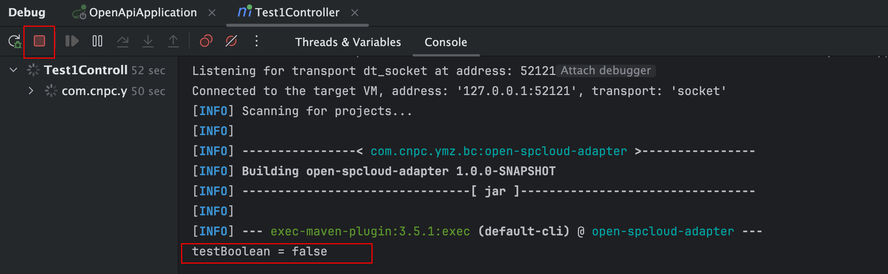
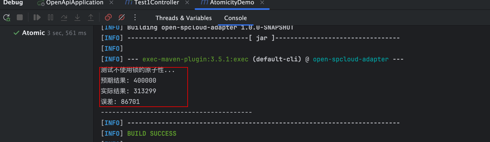

# JUC-synchronized 
## 并发编程三个特性
分别是：
- 可见性
- 原子性
- 有序性

可见性：
- 有两个线程，B线程对共享变量的修改A线程可以获取到共享变量的最新值

代码demo展示效果：
```java
private static boolean testBoolean = true;

public static void main(String[] args) throws InterruptedException {
    new Thread(()->{
        while(testBoolean){

        }
    }).start();

    Thread.sleep(2000);

    new Thread(()->{
        testBoolean = false;
    }).start();
    System.out.println(String.format("testBoolean = %s", testBoolean));
}
```
运行效果如下：
- 可以看到程序一直在运行中，没有退出，说明线程A testBoolean 的值是 true, 


原子性：
- 一组操作要么全部执行完毕，要么全部不执行，不会出现部分执行，部分没执行的情况。

代码demo展示效果：
```java
private static class Counter {
    @Getter
    private int count = 0;
    private final Object lock = new Object();
    @Getter
    private final int iterations;

    public Counter(int iterations) {
        this.iterations = iterations;
    }

    // 非原子性递增
    public void incrementWithoutLock() {
        for (int i = 0; i < iterations; i++) {
            count++;
        }
    }

    // 原子性递增（使用锁）
    public void incrementWithLock() {
        for (int i = 0; i < iterations; i++) {
            synchronized (lock) {
                count++;
            }
        }
    }

    public void reset() {
        count = 0;
    }

}

public static void main(String[] args) throws InterruptedException {
    int iterations = 100000;
    Counter counter = new Counter(iterations);
    int threadCount = 4;

    // 测试非原子性操作
    System.out.println("测试不使用锁的原子性...");
    runTest(counter, threadCount, Counter::incrementWithoutLock);

    // 短暂暂停以便区分两次测试
    // Thread.sleep(1000);

    // 测试原子性操作
    // System.out.println("\n测试使用锁的原子性...");
    // runTest(counter, threadCount, Counter::incrementWithLock);
}

private static void runTest(Counter counter, int threadCount, java.util.function.Consumer<Counter> incrementMethod) throws InterruptedException {
    counter.reset();
    Thread[] threads = new Thread[threadCount];

    // 创建并启动线程
    for (int i = 0; i < threadCount; i++) {
        threads[i] = new Thread(() -> incrementMethod.accept(counter));
        threads[i].start();
    }

    // 等待所有线程完成
    for (Thread thread : threads) {
        thread.join();
    }

    int expected = counter.getIterations() * threadCount;
    System.out.printf("预期结果: %d%n", expected);
    System.out.printf("实际结果: %d%n", counter.getCount());
    System.out.printf("误差: %d%n", expected - counter.getCount());
    System.out.println("----------------------------------------");
}
```
运行效果如下：



有序性：
- 程序执行的代码按照代码的先后顺序执行，但是在实际运行中，为了优化性能，编译器、处理器或内存系统可能会对指令进行 重排序（Reordering），导致程序执行顺序与代码顺序不一致

## 使用 synchronized

用法：

- 修饰实例方法 
- 修饰静态方法
- 修饰代码块

分别介绍：

1、修饰实例方法

```java
public synchronized void incrementWithSynchronized() {
    for (int i = 0; i < iterations; i++) {
        count++;
    }
}
```

2、修饰静态方法
```java

```

3、修饰代码块
```java
private static Object  lock = new Object();
public static void main(String[] args) {
    int count = 0;
    synchronized (lock) {
        count++;
    }
}
```
## synchronized 原理
使用 `3、修饰代码块` 当中的代码，执行`javac SyncDemo.java`编译代码，拿到 class 文件，执行` javap -c -s -v -l SyncDemo.clas` 获取反编译结果，可以看到
```java
public static void main(java.lang.String[]);
    descriptor: ([Ljava/lang/String;)V
    flags: (0x0009) ACC_PUBLIC, ACC_STATIC
    Code:
      stack=2, locals=4, args_size=1
         0: iconst_0
         1: istore_1
         2: getstatic     #7                  // Field lock:Ljava/lang/Object;
         5: dup
         6: astore_2
         7: monitorenter
         8: iinc          1, 1
        11: aload_2
        12: monitorexit
        13: goto          21
        16: astore_3
        17: aload_2
        18: monitorexit
        19: aload_3
        20: athrow
        21: return
      Exception table:
         from    to  target type
             8    13    16   any
            16    19    16   any
```
通过上边查看反编译代码可以看到，synchronized是通过 `monitorenter`和`monitorexit`两个指令来实现的，其中monitorenter指向代码开始的位置，monitorexit指向代码结束的位置

可以看到有两个monitorexit指令，分别在7和18行出现，这是为了锁在代码块正常执行和出现异常情况下都能够正常释放。

