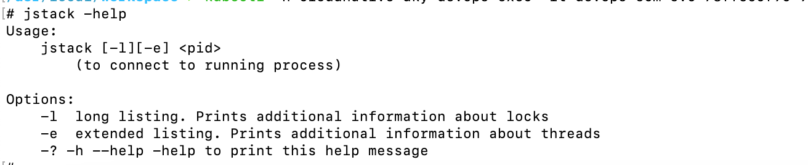

# jstack命令

## 常见用法

- 主要是-l 参数，其他不常用



## 示例

- 执行命令`jstack -l 10 `

```java
# jstack -l 10 
2024-05-24 23:24:33
Full thread dump OpenJDK 64-Bit Server VM (11.0.20+8 mixed mode):

Threads class SMR info:
_java_thread_list=0x00007f88880018f0, length=92, elements={
0x00007f8a387bb000, 0x00007f8a387bf000, 0x00007f8a387d4800, 0x00007f8a387d6800,
0x00007f8a387d8800, 0x00007f8a387da800, 0x00007f8a387dc800, 0x00007f8a38893800,
0x00007f8a3b295000, 0x00007f8a3b2a2000, 0x00007f8a3b267800, 0x00007f8a3b4aa800,
0x00007f8a38e1d000, 0x00007f8a397c4000, 0x00007f8a397c5000, 0x00007f8a3b6f5800,
0x00007f8a3b6db800, 0x00007f8a3adaf800, 0x00007f8a39328000, 0x00007f89b00a5800,
0x00007f89b0077800, 0x00007f89b00b4000, 0x00007f89a406e000, 0x00007f89a8011800,
0x00007f899c0af000, 0x00007f89a407b000, 0x00007f898c00c800, 0x00007f899400c000,
0x00007f8990005000, 0x00007f8984001800, 0x00007f8988001800, 0x00007f897c001800,
0x00007f8974001800, 0x00007f8980001800, 0x00007f8978001800, 0x00007f896c001800,
0x00007f8970001800, 0x00007f8968001800, 0x00007f8964001800, 0x00007f8960001800,
0x00007f895c001800, 0x00007f8958001800, 0x00007f8954001800, 0x00007f8950001800,
0x00007f894c001800, 0x00007f8948001800, 0x00007f893c001800, 0x00007f8934001800,
0x00007f8944001800, 0x00007f89ac001800, 0x00007f8a3b383800, 0x00007f8a39660800,
0x00007f8a3b7c3000, 0x00007f8a3b8f6000, 0x00007f8a3b8fc000, 0x00007f8a3b900000,
0x00007f8a3b910000, 0x00007f8a3b925800, 0x00007f8a3b927800, 0x00007f8a3b929000,
0x00007f8a3b92b000, 0x00007f8a3b92d000, 0x00007f8a3b92f000, 0x00007f8a3b931000,
0x00007f8a3b933800, 0x00007f8910031000, 0x00007f8a3b935800, 0x00007f8a3b937800,
0x00007f8a3b93e000, 0x00007f8a3b94a000, 0x00007f891003c800, 0x00007f88e400f800,
0x00007f88cc0ba800, 0x00007f88d000a800, 0x00007f8a3a301800, 0x00007f8a3802c800,
0x00007f88c0023000, 0x00007f88c0002800, 0x00007f88c0003000, 0x00007f88c0025000,
0x00007f88c0026000, 0x00007f88c0027800, 0x00007f88c002e000, 0x00007f88c0030000,
0x00007f88c0032000, 0x00007f88e4002000, 0x00007f88e4011000, 0x00007f88e4012000,
0x00007f88a844e000, 0x00007f89f8004800, 0x00007f88a84c3000, 0x00007f8918007800
}

"Reference Handler" #2 daemon prio=10 os_prio=0 cpu=43.73ms elapsed=65039.30s tid=0x00007f8a387bb000 nid=0x12 waiting on condition  [0x00007f8a3c223000]
   java.lang.Thread.State: RUNNABLE
	at java.lang.ref.Reference.waitForReferencePendingList(java.base@11.0.20/Native Method)
	at java.lang.ref.Reference.processPendingReferences(java.base@11.0.20/Reference.java:241)
	at java.lang.ref.Reference$ReferenceHandler.run(java.base@11.0.20/Reference.java:213)

   Locked ownable synchronizers:
	- None

"Finalizer" #3 daemon prio=8 os_prio=0 cpu=1836.15ms elapsed=65039.30s tid=0x00007f8a387bf000 nid=0x13 in Object.wait()  [0x00007f8a3c122000]
   java.lang.Thread.State: WAITING (on object monitor)
	at java.lang.Object.wait(java.base@11.0.20/Native Method)
	- waiting on <no object reference available>
	at java.lang.ref.ReferenceQueue.remove(java.base@11.0.20/ReferenceQueue.java:155)
	- waiting to re-lock in wait() <0x000000008001f390> (a java.lang.ref.ReferenceQueue$Lock)
	at java.lang.ref.ReferenceQueue.remove(java.base@11.0.20/ReferenceQueue.java:176)
	at java.lang.ref.Finalizer$FinalizerThread.run(java.base@11.0.20/Finalizer.java:170)

   Locked ownable synchronizers:
	- None

"Signal Dispatcher" #4 daemon prio=9 os_prio=0 cpu=0.51ms elapsed=65039.29s tid=0x00007f8a387d4800 nid=0x14 runnable  [0x0000000000000000]
   java.lang.Thread.State: RUNNABLE

   Locked ownable synchronizers:
	- None
```

