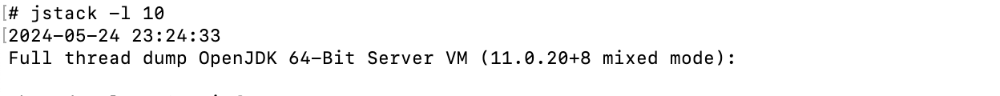
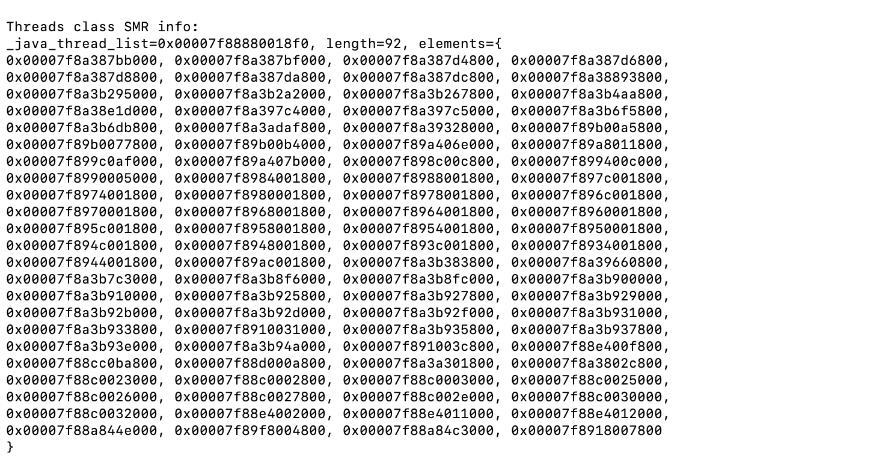
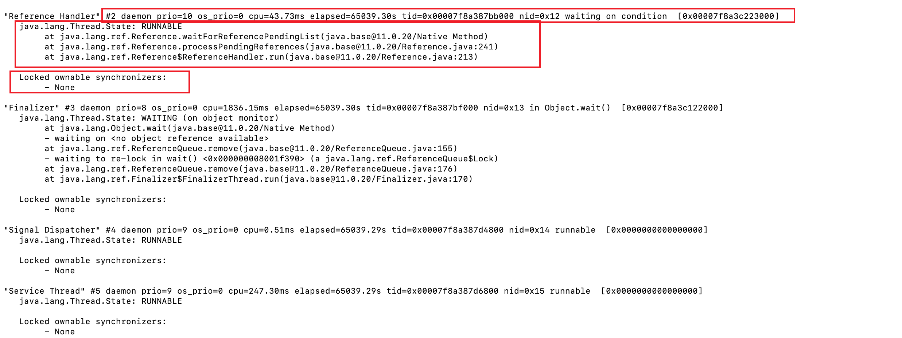
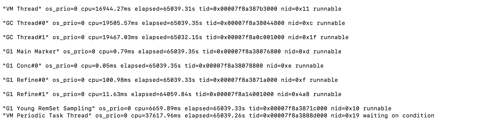
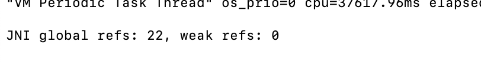

# jstack dump信息详解

- jstack输出的信息当中有以下几块内容：
  - JVM虚拟机的信息
  - Threads class SMR info
  - 线程信息
    - 线程基本信息
    - Thread Stack Trace
    - Locked ownable synchronizers
  - JVM Thread
  - JNI References

## JVM虚拟机信息

- 展示了虚拟机线程dump时间，使用的虚拟机的版本信息，如下图：

## Threads class SMR info

- SMR全称是Safe Memory Reclamation，
- elements当中内容和下边线程的tid是一一对应的，表示的十六进制的地址

## 线程信息

- 线程的基本信息

  - 线程名字:例如Reference Handler
  - 线程的ID:例如#2
  - 是否守护线程:例如daemon，daemon threads是低优先级的thread，它的作用是为User Thread提供服务。 因为daemon threads的低优先级，并且仅为user thread提供服务，所以当所有的user thread都结束之后，JVM会自动退出，不管是否还有daemon threads在运行中。
  - 优先级:例如prio=10
  - OS线程的优先级:例如os_prio=31
  - cpu时间:线程获得CPU的时间,例如cpu=0.67ms
  - elapsed:线程启动后经过的wall clock time
  - tid:java线程的地址
  - nid:OS线程ID

  - 线程状态:例如waiting on condition
  - 最新的Java堆栈指针:最新的java堆栈指针SP，例如:[0x000070000afe1000]

- 线程信息

  - 线程状态：
  - 堆栈信息

- Locked Ownable Synchronizer

  - 是该线程拥有的，可用的用于同步的排它锁对象。
  - Ownable Synchronizer是一个同步器，这个同步器的同步属性是通过使用AbstractOwnableSynchronizer或者它的子类来实现的。例如ReentrantLock和ReentrantReadWriteLock中的write-lock（注意不是read-lock，因为需要排它性）就是两个例子。

## JVM Thread

- JVM的线程信息

## JNI References

- 

## 参考地址

- https://dzone.com/articles/how-to-read-a-thread-dump
