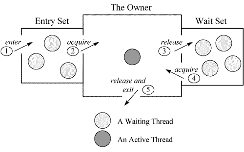
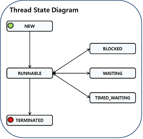

# jvm线程状态

- 执行`jstack -l `查看当前线程的堆栈信息，可以看到线程的堆栈信息，当中有一个部分展示的是：

```
"nioEventLoopGroup-8-4" #694 prio=10 os_prio=0 cpu=13597.70ms elapsed=128507.28s tid=0x00007f88e4012000 nid=0x2c4 runnable  [0x00007f88bb3f4000]
   java.lang.Thread.State: RUNNABLE
	at sun.nio.ch.EPoll.wait(java.base@11.0.20/Native Method)
	at sun.nio.ch.EPollSelectorImpl.doSelect(java.base@11.0.20/EPollSelectorImpl.java:120)
	at sun.nio.ch.SelectorImpl.lockAndDoSelect(java.base@11.0.20/SelectorImpl.java:124)
	- locked <0x00000000818c5678> (a io.netty.channel.nio.SelectedSelectionKeySet)
	- locked <0x00000000818c5578> (a sun.nio.ch.EPollSelectorImpl)
	at sun.nio.ch.SelectorImpl.select(java.base@11.0.20/SelectorImpl.java:141)
	at io.netty.channel.nio.SelectedSelectionKeySetSelector.select(SelectedSelectionKeySetSelector.java:68)
	at io.netty.channel.nio.NioEventLoop.select(NioEventLoop.java:879)
	at io.netty.channel.nio.NioEventLoop.run(NioEventLoop.java:526)
	at io.netty.util.concurrent.SingleThreadEventExecutor$4.run(SingleThreadEventExecutor.java:997)
	at io.netty.util.internal.ThreadExecutorMap$2.run(ThreadExecutorMap.java:74)
	at io.netty.util.concurrent.FastThreadLocalRunnable.run(FastThreadLocalRunnable.java:30)
	at java.lang.Thread.run(java.base@11.0.20/Thread.java:829)

   Locked ownable synchronizers:
	- None
```

- 展示了`java.lang.Thread.State: RUNNABLE`

## 系统线程状态 (Native Thread Status)

系统线程有如下状态：

- deadlock
  - 死锁线程，一般指多个线程调用期间进入了相互资源占用，导致一直等待无法释放的情况。

- runnable
  - 一般指该线程正在执行状态中，该线程占用了资源，正在处理某个操作，如通过SQL语句查询数据库、对某个文件进行写入等。

- blocked
  - 线程正处于阻塞状态，指当前线程执行过程中，所需要的资源长时间等待却一直未能获取到，被容器的线程管理器标识为阻塞状态，可以理解为等待资源超时的线程。

- waiting on condition

  - 线程正处于等待资源或等待某个条件的发生，具体的原因需要结合下面堆栈信息进行分析。
    - 如果堆栈信息明确是应用代码，则证明该线程正在等待资源，一般是大量读取某种资源且该资源采用了资源锁的情况下，线程进入等待状态，等待资源的读取，或者正在等待其他线程的执行等。
    - 如果发现有大量的线程都正处于这种状态，并且堆栈信息中得知正等待网络读写，这是因为网络阻塞导致线程无法执行，很有可能是一个网络瓶颈的征兆：

  - 网络非常繁忙，几乎消耗了所有的带宽，仍然有大量数据等待网络读写；

  - 网络可能是空闲的，但由于路由或防火墙等原因，导致包无法正常到达；

  - 所以一定要结合系统的一些性能观察工具进行综合分析，比如netstat统计单位时间的发送包的数量，看是否很明显超过了所在网络带宽的限制；观察CPU的利用率，看系统态的CPU时间是否明显大于用户态的CPU时间。这些都指向由于网络带宽所限导致的网络瓶颈。
    - 还有一种常见的情况是该线程在 sleep，等待 sleep 的时间到了，将被唤醒。

- waiting for monitor entry
  - Moniter 是Java中用以实现线程之间的互斥与协作的主要手段，它可以看成是对象或者class的锁，每个对象都有，也仅有一个 Monitor。



## JVM线程运行状态 (JVM Thread Status)



- 在 [java.lang.Thread.State](https://docs.oracle.com/javase/7/docs/api/java/lang/Thread.State.html) 中定义了线程的状态：

- NEW
- 至今尚未启动的线程的状态。线程刚被创建，但尚未启动。

- RUNNABLE

- 可运行线程的线程状态。线程正在JVM中执行，有可能在等待操作系统中的其他资源，比如处理器。

- BLOCKED

- 受阻塞并且正在等待监视器的某一线程的线程状态。处于受阻塞状态的某一线程正在等待监视器锁，以便进入一个同步的块/方法，或者在调用 Object.wait 之后再次进入同步的块/方法。
  在Thread Dump日志中通常显示为 *java.lang.Thread.State: BLOCKED (on object monitor)* 。

- WAITING

- 某一等待线程的线程状态。线程正在无期限地等待另一个线程来执行某一个特定的操作，线程因为调用下面的方法之一而处于等待状态：

- 不带超时的 Object.wait 方法，日志中显示为 *java.lang.Thread.State: WAITING (on object monitor)*
- 不带超时的 Thread.join 方法
- LockSupport.park 方法，日志中显示为 *java.lang.Thread.State: WAITING (parking)*

- TIMED_WAITING

- 指定了等待时间的某一等待线程的线程状态。线程正在等待另一个线程来执行某一个特定的操作，并设定了指定等待的时间，线程因为调用下面的方法之一而处于定时等待状态：

- Thread.sleep 方法
- 指定超时值的 Object.wait 方法
- 指定超时值的 Thread.join 方法
- LockSupport.parkNanos
- LockSupport.parkUntil

- TERMINATED

- 线程处于终止状态。

- 根据Java Doc中的说明，在给定的时间上，一个只能处于上述的一种状态之中，并且这些状态都是JVM的状态，跟操作系统中的线程状态无关。