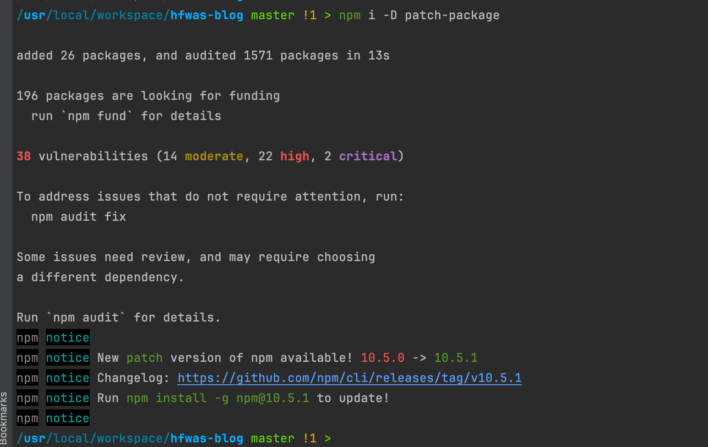
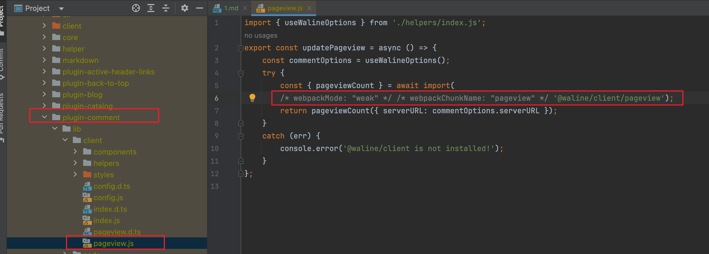
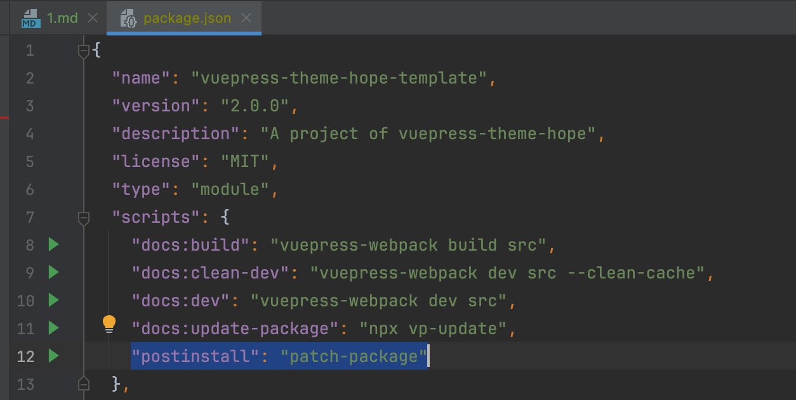
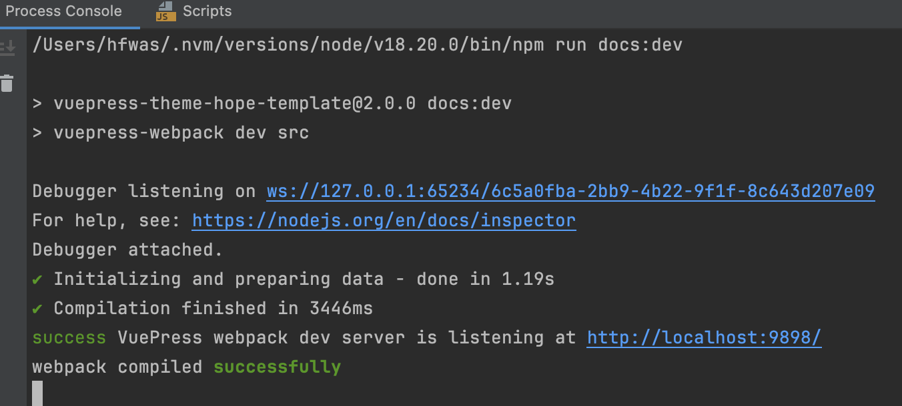

# 打补丁解决前端bug

- 安装依赖 patch-package，执行` npm i -D patch-package`

- 修改node_modules目录下对应的依赖的文件内容，本次结局的bug是控制台会出现webpack的警告，

- 控制台执行命令，生成patch文件，执行命令：`npx patch-package @vuepress/plugin-comment`,然后会在项目目录下生成一个patches文件夹，内容为

- 将patches文件夹添加到版本控制当中，后续执行，执行`npm install`的时候会自动执行patch文件
  - 测试步骤，将本地的`node_modules`删掉，重新`npm install`会发现，自动执行`npm path` 
- 在package.json文件当中添加一行数据，数据内容为：`"postinstall": "patch-package"`

- 删除`.vuepress`目录下的`.cache`文件夹，重新启动，控制台不会出现警告信息

- 问题解决。
