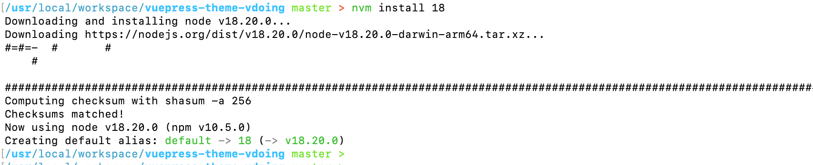
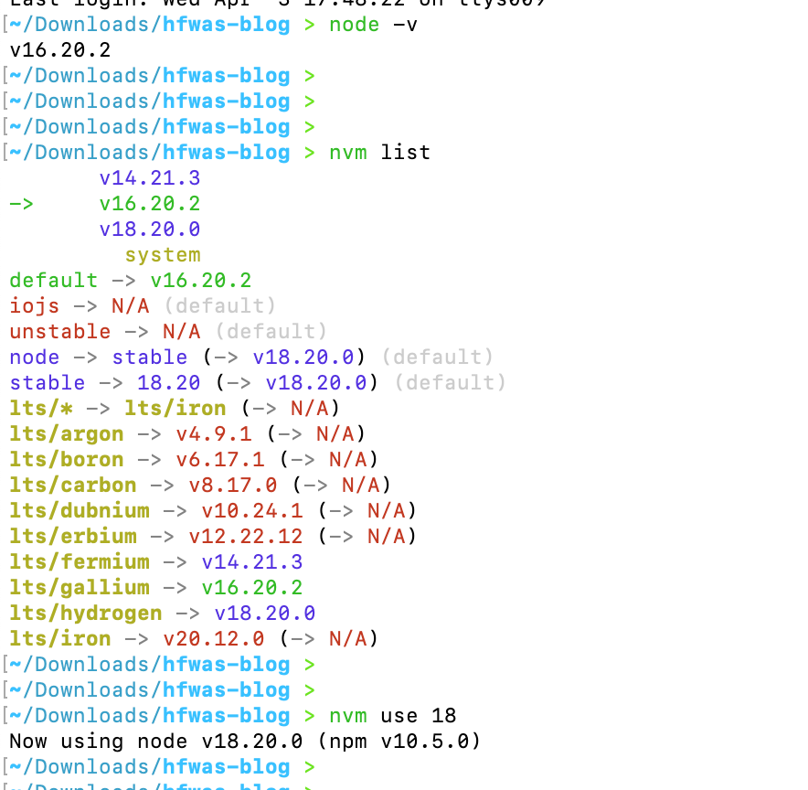

# 前端-nvm切换版本不生效

- 前置环境：
  - mac m1
  - nvm版本：v0.39.7
- 安装node18版本，执行`nvm install node18`

- 执行查看node版本，切换为node18，但是新开tab页，执行`node -v`发现还是原来的16

- 执行命令，修改nvm的default选项，修改为node18，执行`nvm alias default v18.20.0 `
- 再次查看node版本，新开tab页测试，都是目前的nvm选中的版本。
- 问题解决。
