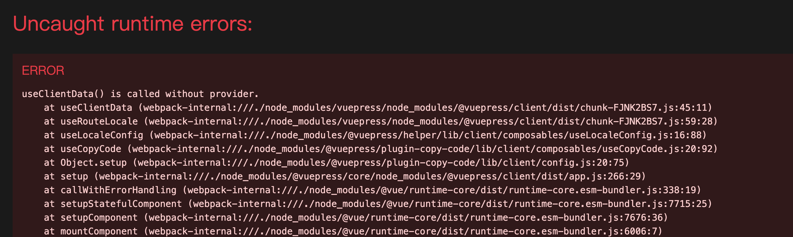
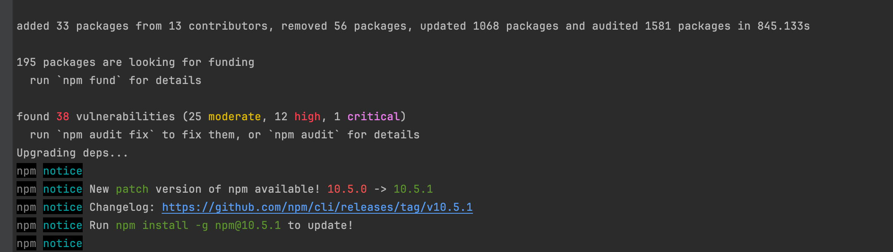

# useClientData() is called without provider

## 现象

- 本地vuepress-theme-hope模版项目启动之后，浏览器出现以下报错，截图如下：

## 解决办法

- 项目根目录下执行`npx vp-update `,具体效果如下：

- 再次访问前端页面，没有问题了
- 问题解决！

## 参考资料

- GitHub [discussion](https://github.com/vuepress/core/discussions/103) 