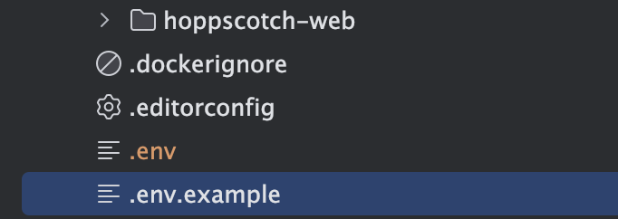
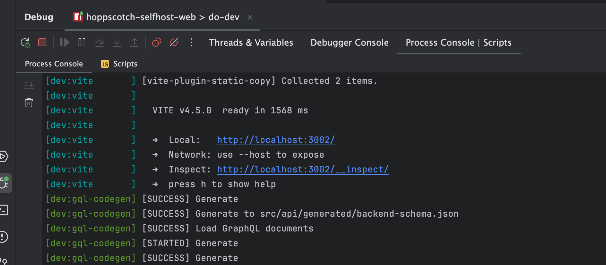
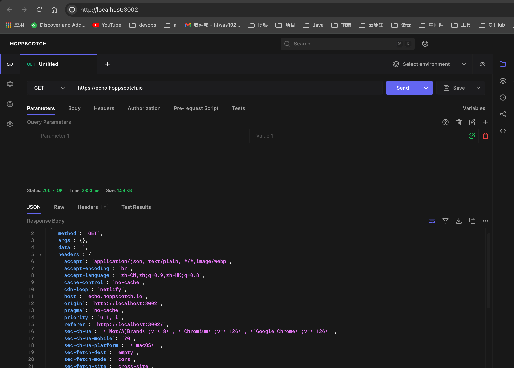

# 本地编译启动[hoppscotch](https://github.com/hoppscotch/hoppscotch)

- 全局安装pnpm，执行`npm install -g pnpm`
- 克隆代码到本地，访问：https://github.com/hoppscotch/hoppscotch
- 拷贝一份`.env.example`，重命名为`.env`，内容不用变

- 执行`pnpm install`
- 执行`pnpm run dev`
- 控制台打印如下：

- 页面效果如下：

## 其他问题

