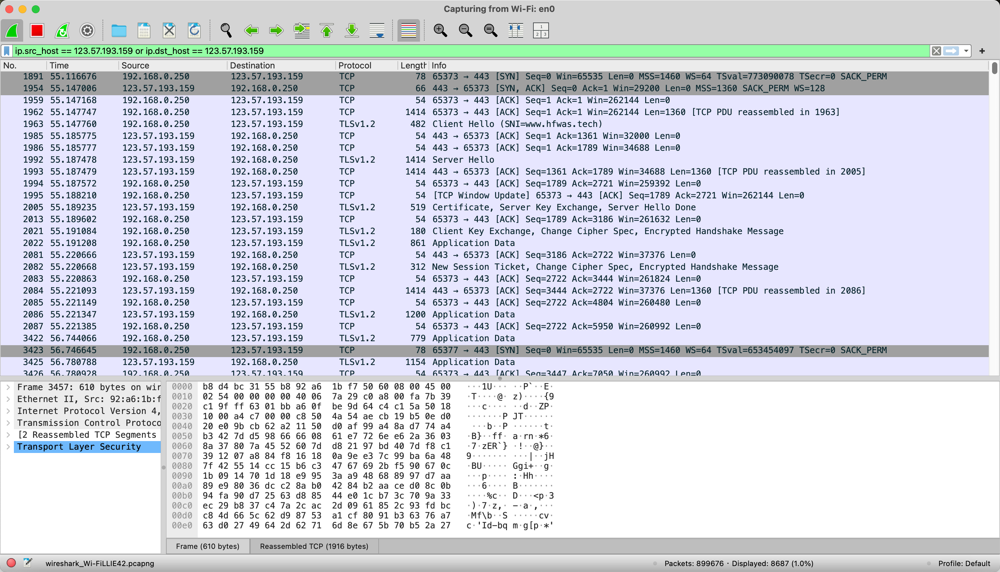

# HTTPS 的加密过程

## 总体流程

- tcp三次握手
- 客户端发起client hello
- 服务端server hello
- 服务器发送证书
- 客户端密钥交换
- 加密数据传输
- 连接关闭

## 详细流程

- 首先进行三次握手，
  - 客户端发送建立请求SYN
  - 服务端同意建立请求SYN+ACK
  - 客户端确认ACK
- 服务端发送密钥
- 客户端密钥确认，
- 服务端发送数据
- 连接关闭，四次挥手