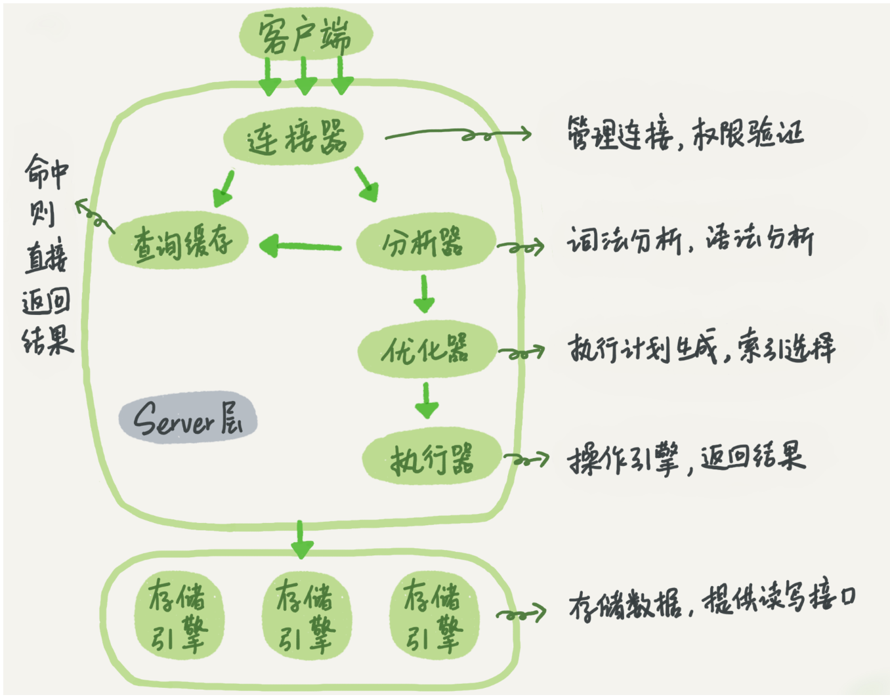

---
category:
  - MySql
tag:
  - MySql
---
# MySql-查询语句是如何执行

## mysql基本架构图

- Mysql分为两部分
  - Server层
    - 连接器
    - 查询缓存
    - 分析器
    - 优化器
    - 执行器等
  - 存储引擎
    - 负责数据的存储和提取
    - 支持innodb，misaim，memory等多个存储引擎
- 

## 连接器

- 连接数据库，首先会到连接器。连接器负责跟客户端建立连接，获取权限，维持和管理连接。
- 执行连接命令之后，首先完成经典的三次握手之后，连接器开始校验用户密码，这时使用的就是-u和-p传输的信息，
- 连接建立之后，如果没有任何操作，连接就处于空闲状态了，可以在数据库当中执行`show processlist;`查看

- 客户端如果太长时间没有任何操作，连接器就会自动断开连接。时间是由wait_timeout参数设置的。默认是8小时
- 连接分为长连接和短连接。
  - 长连接：连接成功之后，如果客户端持续有请求，就会一直使用同一个连接，
    - 缺点：可能会导致mysql内存占用涨的速度特别快，因为mysql在执行过程当中临时使用的内存是管理在连接对象里面。这些资源会在连接断开的时候释放掉。如果长连接累计下来，可能会导致内存占用过大，导致mysql进程重启
    - 解决方法：
      - 定期断开长连接：
      - mysql5.7版本之后，可以执行mysql_Reset_connection来重新出实话连接资源。
  - 短连接：每次执行完很少的几次查询之后就会断开连接。下次查询会再建立连接
- 

## 查询缓存

- mysql会将执行执行的结果缓存到内存当中，以key-value的形式。当执行查询的时候，首先会在缓存当中查询是否有命中，如果有，直接返回结果
- 但是大多数情况下不要使用查询缓存，因为每次表更新都会清除掉查询缓存。
- Mysql提供了按需使用的方式，可以将参数query_cache_type设置成DEMAND,对于确定要使用的sql语句，可以添加sql_cache显示指定。执行`select SQL_CACHE * from 表名`

## 分析器

- 分为两块，词法分析和语法分析。
- mysql会识别传入的sql语句，识别sql语句当中的字符代表什么分别是什么。
- 做完词法分析之后，根据词法分析的结果，语法分析器按照语法规则，判断输入的sql语句是否满足mysql用法。

## 优化器

- 优化器是在执行之前，
  - 在表当中有多个索引的情况下，决定使用那个索引。
  - 在一个语句当中有多表关联的情况下，决定各个表的连接顺序。

