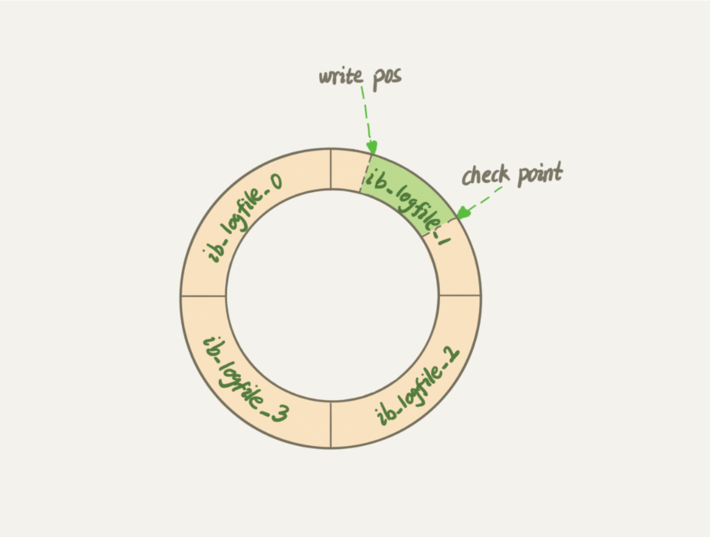
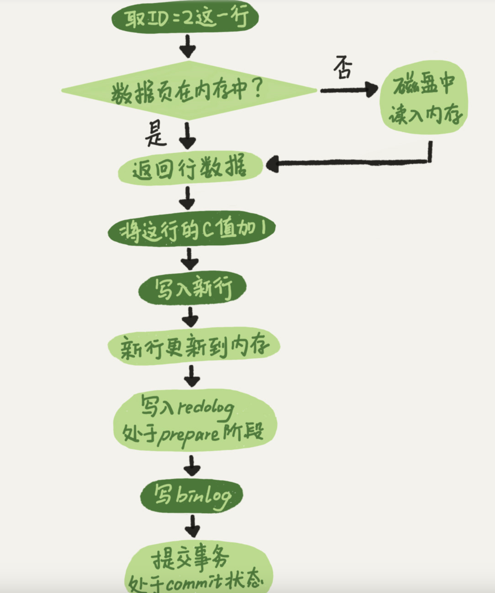

---
category:
  - MySql
tag:
  - MySql
---
# MySql-更新语句是如何执行

- 更新语句与查询语句相比，分析器会通过词法和语法解析知道这是一个更新语句，

## WAL技术

- 在 MySql 当中如果每一次更新都要写磁盘，然后磁盘也要找到对应的那条更新的记录，然后再更新，整个过程当中IO技术，查找成本都比较高，然后使用到 WAL 技术，别名是 Write-Ahead Logging，关键点是先写日志，再写磁盘。
- 详细介绍：当有数据更新时，InnoDB 引擎就会先把记录写到 redo log 当中，并且更新到内存当中，这个时候更新就算完成了。同时 InnoDB 引擎会在合适的时候，将这个操作更新到磁盘当中，而这个更新往往会在系统比较清闲的时候。

## 日志模块

- redo-log 和 binlog 日志不同点：
  - redo log 是 InnoDB 引擎特有的，binlog 是 MySql 的 server 层实现的，所有引擎都可以实现
  - redo log 是物理日志，记录的是在某个数据页做了什么修改。binlog是逻辑日志，记录的是这个语句的原始逻辑，比如：给id=2这一行的c字段加1
  - redo log 是循环写的，空间固定会写完。binlog 是可以追加写入的，追加写是指 binlog 文件写到一定大小之后会切换到下一个，并不会覆盖以前的日志。

### redo log

- 是 InnoDB 引擎特有的日志。大小是固定的，比如：可以配置四个文件，每个文件大小是 1gb，从头开始写记录，写到末尾又会到开头循环写。如图：

- Write poc 是当前记录的位置，一边写一边后移，写到第三号文件末尾后就会到0号文件开头。check point 是当前要擦除的位置，也是往后推移并且循环的，擦除记录前要把记录更新到数据文件。
- write doc 和 check point 之间的是粉板上还空着的部分，可以用来记录新的操作。如果 write poc 追上 check point 表示粉板满了，这时候不能再执行新的更新，得停下来先擦除掉一些记录，把 chek point 推进一下。
- 有了 redo log， InnoDB 就可以保证即使数据库发生异常重启，之前提交的记录都不会丢失，这个能称为 crash-safe。

### binlog

- server 层的日志，被称为归档日志。

- Mysql 自带的引擎是 MyISAM 引擎，但是 MyISAM 当中没有 crash-safe 的能力，binlog 日志只能用于归档。InnoDB 是另外一家公司以插件的形式引入 Mysql 的，既然只依靠 binlog 是没有 crash-safe 能力，所以 InnoDB 使用另外一套日志系统，也就是 redo-log 来实现 crash-safe能力。

## 更新语句执行

- 如图：

## 两阶段提交

- 为什么必须有两阶段提交呢？就是为了让两份日志之间的逻辑保持一致
  - 先写 redo log 后写 binlog
    - 假设在 redo log 写完，binlog 还没有写完的时候，MySQL 进程异常重启。由于我们前面说过的，redo log 写完之后，系统即使崩溃，仍然能够把数据恢复回来，所以恢复后这一行 c 的值是 1。
      但是由于 binlog 没写完就 crash 了，这时候 binlog 里面就没有记录这个语句。因此，之后备份日志的时候，存起来的 binlog 里面就没有这条语句。
      然后你会发现，如果需要用这个 binlog 来恢复临时库的话，由于这个语句的 binlog 丢失，这个临时库就会少了这一次更新，恢复出来的这一行 c 的值就是 0，与原库的值不同 
  - 先写  binlog 后写 redo log
    - 如果在 binlog 写完之后 crash，由于 redo log 还没写，崩溃恢复以后这个事务无效，所以这一行 c 的值是 0。但是 binlog 里面已经记录了“把 c 从 0 改成 1”这个日志。所以，在之后用 binlog 来恢复的时候就多了一个事务出来，恢复出来的这一行 c 的值就是 1，与原库的值不同
- binlog 会记录所有的逻辑操作，并且采用追加写的形式，
- 如何让数据库恢复到半个月内任意一秒的状态
  - MySQL 备份系统当中一定会保存半个月内的所有 binlog ,同时系统会定期做整库备份。
  - 当需要恢复到指定的某一秒时，
    - 首先，找到最近的一次全量备份，如果运气好，可能是昨天晚上的一个备份，从这个备份恢复到临时库。
    - 然后从备份的时间点开始，将备份的 binlog 依次取出来，重放到中午误删表之前的那个时刻。
    - 这样临时库就跟误删之前的数据库一样了，可以将表数据从临时库当中取出来，按需要恢复到线上库