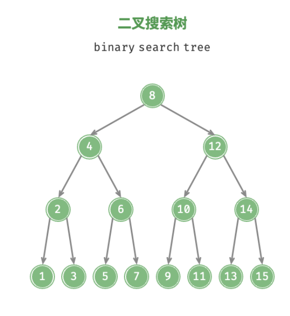

---
category:
  - MySql
tag:
  - MySql
---
# MySql-索引

> 这里有一点个人看法，我们理解数据库数据结构选型的时候，结合现实开发当中的情形，通常读占有大部分的情况，伴有数据新增，数据更新，数据删除的场景，那么一个数据库数据结构首先要满足我们对于查询速度的考量，其次插入数据，更新数据，删除数据也要有不俗的变现

- 索引的出现是为了提高查询效率，类似一本书，查找内容，一种方式是通过目录来快速查看，一种是翻页从头到尾来检索，这里的目录就是索引

## 索引模型

- 提高读写效率的数据结构有很多，有以下这些数据结构，分别是：
  - 哈希表
  - 有序数组
  - 二叉搜索树
  - 平衡二叉搜索树
  - 红黑树
  - B 树
  - B+ 树

### 哈希表

- 哈希表是一种以键-值（key-value）存储数据的结构。哈希表是通过计算 key 的哈希值将 key 换算成一个确定的位置，中间会有多个 key 计算 hash 相同的情况，也就是 hash 冲突的问题，解决的办法是：value 设置成一个链表，将值 value 追加到链表后边。
- 获取值的时候，通过传入的 key 获取对应的 value 链表，然后遍历链表，找到匹配的值
- 缺点：范围查询场景不适合，因为值 value 链表不是有序的，根据 key 获取到对应的链表结构时，需要遍历链表，找到对应的值。做区间查询的时候，必须全部扫描一遍。例如：查询【3，8】范围的内的所有数据。
- 适用场景：适合等值查询的场景

### 有序数组
- 查询数据支持通过下标快速检索，新增数据需要将 index 下标之后的数据拷贝到 index + 1 位置，逐个拷贝，删除场景下类似，将 index + 1 下标之后的数据挪到 index 位置，index 位置之后数据逐个执行
- 这样对于查询场景很友好，但是更新操作效率太低
- 适用场景：适合等值查询和范围查询场景，查询效率很高，有序数组索引只适用于静态存储引擎
- 缺点：不适合经常新增和删除数据的场景，动态数组当中更新一次数组，需要挪动后边的所有数据，变动太大，成本太高

### 二叉搜索树

- 特点：左子节点小于父节点，右子节点大于父节点
- 时间复杂度：O(log(N))
  - 为了保持搜索复杂度是O(log(N))，需要保证二叉搜索树是一个平衡二叉搜索树，这样每次更新的时间复杂度是 O(log(N))
- 缺点：二叉搜索树很可能会`长歪`，
- 索引选型：
  - 二叉树搜索效率最高，大多数数据库存储并不使用二叉树，而使用多叉树
  - 原因：索引不仅存储在内存当中，还要存储到磁盘上。为了让查询尽量减少读磁盘的操作，就必须让查询过程访问尽量少的数据库
  - 示例：例如有一颗一百万节点的平衡二叉树，树高20，一次查询可能需要访问20个数据块，在机械硬盘时代，从磁盘随机读一个数据块需要10ms左右的寻址时间，那么一个一百万行的表，如果使用二叉树来存储的话，单独访问一个行可能需要20个10ms的时间。

### 平衡二叉搜索树(AVL)
- 特点：在二叉搜索树的基础上，增加了一个特点：任意节点的左右子树高度不超过1，
- 时间复杂度：O(log(N))
- 为了保证树的平衡，AVL 增加了 LL/RR/LR/RL 四种旋转操作，通过旋转节点来实现树的平衡，这样 AVL 避免了长歪的风险，通过旋转等操作维持树的平衡，确保插入/删除的时间复杂度都为 O(log(N))
- 使用场景：适合频繁插入/删除等操作的场景
- 缺点：AVL 树为了保持平衡，增加了旋转操作，旋转操作又是比较耗时的

### 红黑树

- 特点：红黑树并不要求绝对的平衡，而是相对的平衡，在新增/删除的场景下，通过对节点旋转和染色操作来保证基本的平衡
- 存在红黑树的树高比较高的情况，这样查询效率比较差，对于数据库来说，每一次的 IO 操作都是比较耗时的，所以树高成为影响红黑树成为索引选项的阻碍

### B 树

- 特点：与二叉树相比，B树的每个非叶节点可以有多个子树，因此在总结点数量相同情况下，B树的层高是要远远低于AVL树和红黑树的
- 以一个m阶B树为例，B树需要满足的条件：
  - 每个节点最多只有m个子节点
  - 每个非叶子节点（除了根）具有至少【m/2】子节点
  - 如果根不是叶节点，根至少有两个子节点
- 叶子节点和非叶节点都会存储索引加数据，这样每个节点都要耗费比较多的存储空间

### B+ 树

- 特点：只有叶子节点才会存储数据，非叶节点存储索引数据，B+树的叶子节点通过双向链表来连接
- 针对B树来说优点：
  - 更小的存储空间：B+树只有叶子节点存储数据，非叶节点存储索引
  - 更适合范围查询：B+树的叶子节点通过双向链表来连接，范围查询直接针对叶子节点做遍历即可

## 索引模型

- 表都是根据主键顺序以索引的形式存放的，这种存储方式的表称为索引组织表，都是存储在B+树当中
- 每一个索引在 InnoDb 里边对应一颗 B+ 树

### 索引类型

- 主键索引和非主键索引
- 主键索引
  - 叶子节点存储的是整行数据，在 InnoDB 当中主键索引也被称为聚簇索引
- 非主键索引
  - 叶子节点存储的是主键的值，在 InnoDB 当中非主键索引也被称为二级索引

### 回表

- 主键查询方式，只需要搜索id这颗B+树
- 普通索引方式，需要先搜索普通索引树，得到主键的值，再到主键索引树搜索一次，这个过程称为回表
- 也就是说，基于非主键索引的查询需要多扫描一颗索引树，因此，在应用中应该多尽量使用主键查询