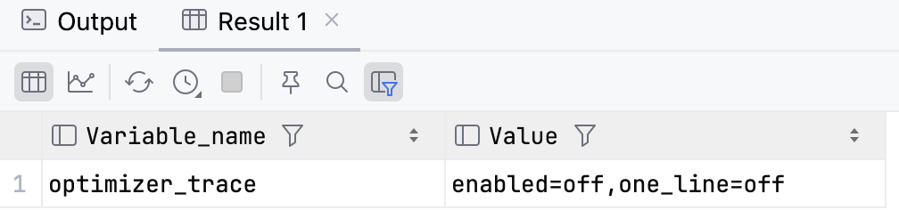

# MySql-执行计划

MySql 给我们提供了 explain 命令来分析 Sql 语句的性能，

## 分析步骤

获取需要分析执行计划的 Sql 语句，加 expalin 命令，格式`explain sql语句`，会得到以下的结果：

```sql
mysql> explain select * from users; 
+----+-------------+-------+------------+-------+---------------+--------------+---------+------+------+----------+-------------+
| id | select_type | table | partitions | type  | possible_keys | key          | key_len | ref  | rows | filtered | Extra       |
+----+-------------+-------+------------+-------+---------------+--------------+---------+------+------+----------+-------------+
|  1 | SIMPLE      | users | NULL       | index | NULL          | idx_username | 259     | NULL |    1 |   100.00 | Using index |
+----+-------------+-------+------------+-------+---------------+--------------+---------+------+------+----------+-------------+
1 row in set, 1 warning (0.00 sec)

mysql> 
```

explain 返回的结果有12列，分别是：

| id   | select_type | table | partitions | type | possible_keys | key  | key_len | ref  | rows | filtered | Extra |
| ---- | ----------- | ----- | ---------- | ---- | ------------- | ---- | ------- | ---- | ---- | -------- | ----- |

## explain 结果

### id

- 在一个大的查询语句种每个 select 关键字都对应一个唯一的 id 
- 连接查询的执行计划当中，每个表都会对应一条记录，这些记录的 id 值是一样的，出现在前边的是驱动表，后边的是被驱动表

### select_type

- select 关键字对应的那个关键字对应的类型

| 值           | 描述                                                         |
| ------------ | ------------------------------------------------------------ |
| SIMPLE       | 简单的 SELECT 语句（不包括 UNION 操作或子查询操作）          |
| PRIMARY      | 查询中最外层的 SELECT（如两表做 UNION 或者存在子查询的外层的表操作为 PRIMARY，内层的操作为 UNION |
| UNION        | UNION 操作中，查询中处于内层的 SELECT，即被 union 的 SELECT  |
| SUBQUERY     | 子查询中的 SELECT                                            |
| DERIVED      | 表示包含在 From 子句中的 Select 查询                         |
| UNION RESULT | union 的结果,此时 id 为 NULL                                 |

### table

- 涉及的表名称

### partitions

- 匹配的分区信息

### type

- 针对单表的访问方法

| 值     | 描述                                                         |
| ------ | ------------------------------------------------------------ |
| system | 表只有一行，MyISAM 引擎所有                                  |
| const  | 常量连接，表最多只有一行匹配，通常用于主键或者唯一二级索引列与常数惊醒等值匹配时 |
| eq_ref | 表关联查询时，对于前表的每一行,后表只有一行与之匹配。(1) join查询(2) 命中主键或者非空唯一索引 |
| ref    | 只使用了索引的最左前缀或者使用的索引是非唯一索引、非主键索引 |
| range  | between，in，>等都是典型的范围(range)查询                    |
| index  | 需要扫描索引上的全部数据                                     |
| all    | 全表扫描                                                     |

### possible_keys

- 可能用到的索引方法

### key

- 实际上使用的索引

### key_len

- 实际上使用的索引长度

### ref

- 当使用索引列等值查询时，与索引列进行等值匹配的对象信息

### rows

- 结果集的行数

### filtered

- 某个表经过搜索条件过滤后剩余记录条数的百分比

### Extra

- 一些额外的信息

| 值                    | 描述                                                         |
| --------------------- | ------------------------------------------------------------ |
| Using index           | select后面的查询字段在索引中就可以取到,无需再回表了,即所谓的覆盖索引,这种查询性能很好 |
| Using filesort        | 当order by 无法利用索引完成排序时,优化器不得不选择合适的算法从内存或者磁盘进行排序 |
| Using temporary       | 使用了临时表                                                 |
| Using index condition | mysql5.6之后引入了ICP(索引条件下推)                          |
| Using where           | Mysql 服务器在存储引擎检索行后再进行过滤                     |

## 工具

MySql 5.6 之后的版本给用户提供了一个 optimizer_trace 的功能，可以让我们能够方便的查看 mysql 优化器生成执行计划的整个过程

执行`show variables like 'optimizer_trace';`查看可以查看功能的状态：



one_line 值是控制格式的，如果为 on 所有数据都会在一行中展示

可以执行`SET optimizer_trace="enabled=on";`打开 optimizer_trace 功能
