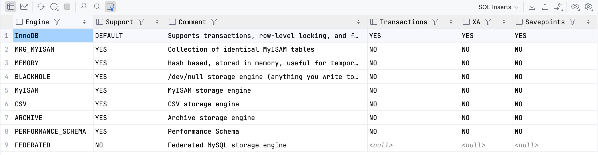

# Mysql-存储引擎

执行`select version();`查看当前 mysql 版本，我本地版本是5.7.41

## 基础架构

- 连接器
- 查询缓存
- 分析器
- 优化器
- 执行期
- 存储引擎

## 存储引擎

- 执行`show engines;`查看当前 mysql 的所有引擎列表

- 查看当前 mysql 使用的存储引擎，执行`show variables like '%storage_engine%';`查看，可以看到 5.7.41版本的 mysql 默认支持 InnoDB

## InnoDB 和 MyISAM 对比

通过下边表格对比两个存储引擎的差异：

| 对比     | InnoDB              | MyISAM |
| -------- | ------------------- | ------ |
| 崩溃恢复 | 支持，依赖 redo log | 不支持 |
| 行锁     | 支持                | 不支持 |
| 表锁     | 支持                | 支持   |
| 事物     | 支持                | 不支持 |
| 外键     | 支持                | 不支持 |
| MVCC     | 支持                | 不支持 |

还有一个比较完整的功能点对比图，来自于[mysql是怎样运行的 从根上理解My s q l]()：

